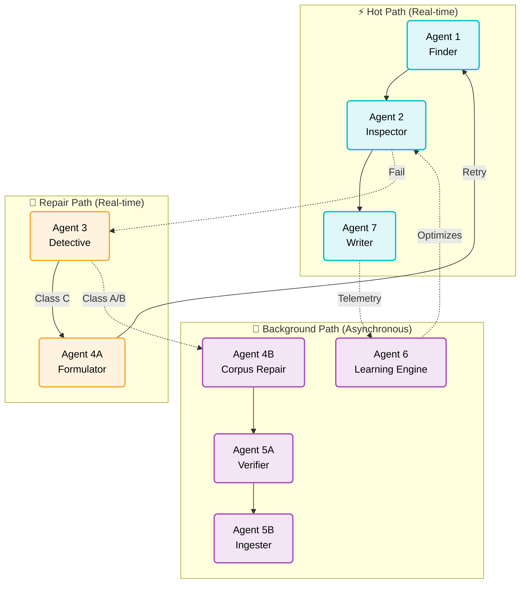
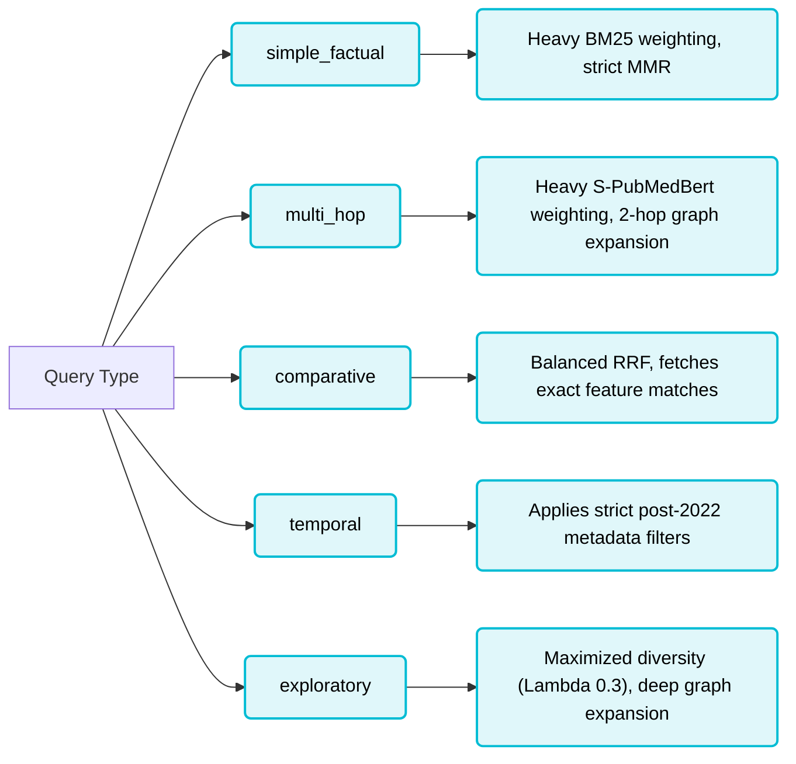
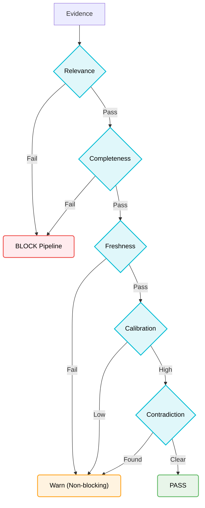
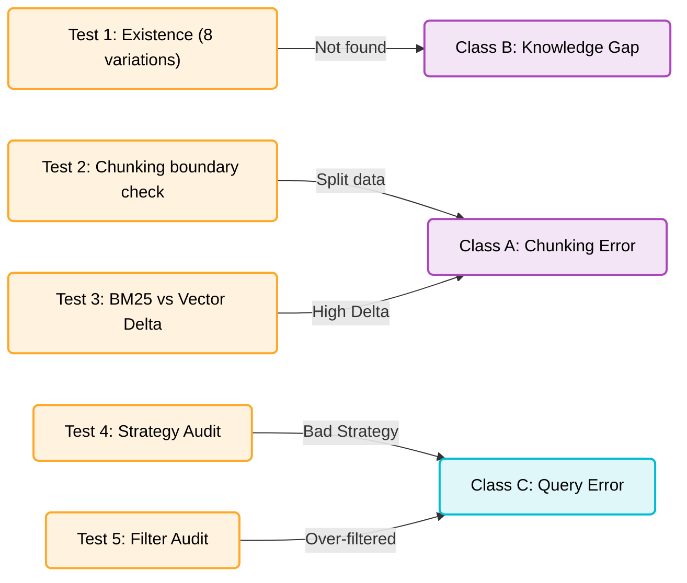
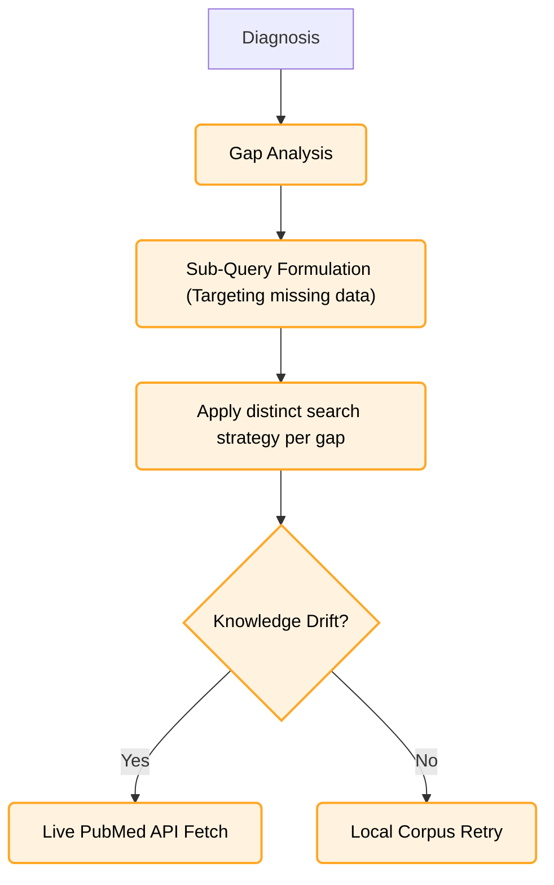
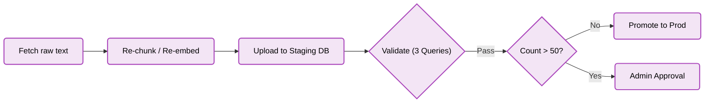
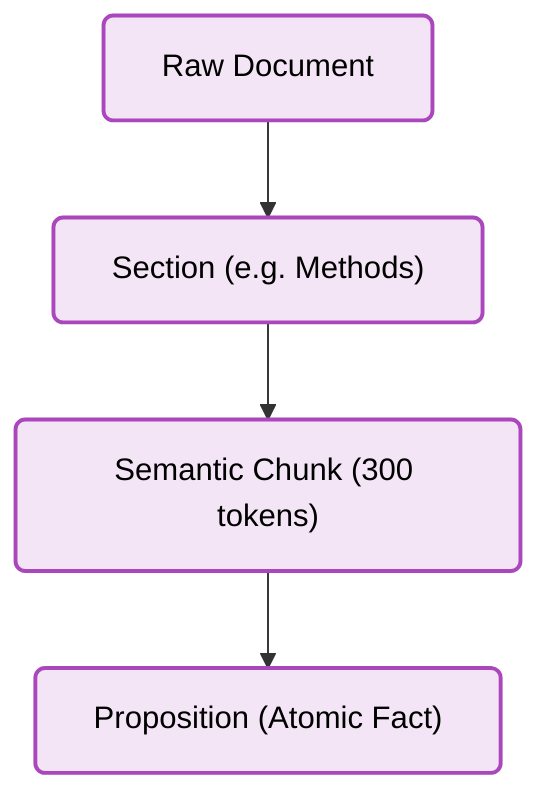
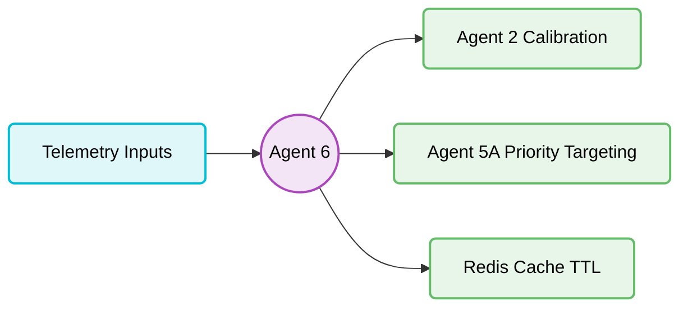

# Self-Learning and Self-Healing RAG — Agent Reference

---

## Overview



---

## Agent 1 — Retrieval

**What it does**
Agent 1 is the primary search engine of Self-Learning and Self-Healing RAG. It takes the user's query and performs a highly optimized hybrid search (dense + sparse) across the vector database, followed by graph expansion to pull in related citation context.

**Receives**
- Query string + session ID

**Returns**
- List of RetrievalResult (Pydantic)

**Five Retrieval Strategies**



**Key design decision**
Metadata pre-filtering is applied *before* the vector search. If we search first and filter later, a query like "CRISPR 2024" might retrieve 5 chunks from 2021, which the filter then deletes, leaving 0 chunks. Pre-filtering ensures we search only within the valid 2024 subset.

**What happens when it fails**
If Agent 1 retrieves `<3 chunks` after MMR filtering, it triggers "Auto-Relax". It drops strict metadata date constraints or relaxes the MMR diversity lambda and searches again to ensure Agent 2 has enough data to inspect.

---

## Agent 2 — Quality Gate

**What it does**
Agent 2 is the firewall against hallucination. It runs five strict checks on the evidence retrieved by Agent 1. If the evidence is insufficient, it hard-blocks the pipeline and triggers a repair.

**Receives**
- List of RetrievalResult
**Returns**
- Agent2Result (Pydantic model)

**The Five Checks**



**Key design decision**
Pre-generation evaluation. Standard RAG generates an answer and then evaluates it. Self-Learning and Self-Healing RAG evaluates the source chunks. If the sources are garbage, we don't waste token generation time (or risk LLM hallucination) trying to summarize them.

**Calibration detail**
Agent 2 dynamically reads historical confidence curves calculated by Agent 6 from Supabase. If the system has historically performed poorly on "drug interaction" queries, Agent 2 artificially lowers its confidence score for that query to remain honest with the user.

---

## Agent 3 — Root Cause Classifier

**What it does**
When Agent 2 blocks a query, Agent 3 steps in to figure out *why*. It runs automated diagnostic tests to classify the failure into one of three distinct error classes so the system knows how to fix it.

**Receives**
- Failed query + rejected chunks
**Returns**
- DiagnosisResult (Pydantic — frozen)

**Five Diagnostic Tests**



**Three Failure Classes**

| Class | Meaning | Routes to |
|---|---|---|
| **Class A** | Data exists but is chunked/embedded poorly | Agent 4B (Background) |
| **Class B** | System does not know the answer at all | Agent 4B (Background) |
| **Class C** | Agent 1 used the wrong search strategy | Agent 4A (Real-time) |

---

## Agent 4A — Gap Formulator

**What it does**
Agent 4A is the real-time repair engine. It takes Class C failures, identifies exactly what is missing, formulates new queries, and forces Agent 1 to try again.

**Receives**
- DiagnosisResult + Original Chunks
**Returns**
- FormulationResult (Pydantic)

**Formulation Flow**



**Key design decision**
Merge-not-replace. The new chunks retrieved by Agent 4A are combined with the original chunks retrieved by Agent 1. We never throw away partial successes.

---

## Agent 4B — Background Corpus Repair

**What it does**
Agent 4B fixes systemic, structural issues in the database without slowing down the user. It is queued asynchronously via Celery.

**Receives**
- Class A / Class B Error Logs
**Returns**
- Database Updates

**Repair Flow**



**Key design decision**
Staging before production. Agent 4B runs "synthetic queries" against repaired chunks in a hidden staging collection. If Agent 2 cannot pass the repaired chunks in staging, the repair is rolled back.

---

## Agent 5A — Relevance Verifier

**What it does**
Agent 5A is the bouncer. Before any new PDF or abstract enters the database, Agent 5A vets it to ensure it is not junk science.

**Receives**
- Raw PDFs / PubMed XML
**Returns**
- VerificationResult (Pydantic)

**Four Checks**

| Check | What it tests | On fail |
|---|---|---|
| Domain | Is this strictly biomedical? | Reject paper |
| Quality | Is this peer-reviewed or an RCT? | Reject paper |
| Impact | Is the citation velocity high? | Reject paper |
| Relevance | Does this fill a known Agent 6 gap? | Reject paper |

**Selective Ingestion Rules**

| Rule | Trigger condition |
|---|---|
| Velocity Bypass | If citation velocity > 50/month, bypass Quality check |
| Gap Bypass | If it perfectly fills a Class B gap, bypass Impact check |

---

## Agent 5B — Selective Ingestion

**What it does**
Takes approved papers from 5A and processes them into the Qdrant and Neo4j databases.

**Four-Level Chunking**



---

## Agent 6 — Longitudinal Learning

**What it does**
Agent 6 watches the entire system and makes it smarter overnight. It processes telemetry to adjust confidence scores and caching rules.

**Three Inputs**
1. Pass/Fail query telemetry
2. User 👍 / 👎 feedback
3. Weekly automated benchmark scores

**Five Outputs**
1. Calibration Curves (lowering overconfidence)
2. Gap Maps (topics people ask about that we lack)
3. Dynamic TTL adjustments
4. Admin recommendations
5. Future drift predictions

**Learning Loops**



**Calibration Detail**
User feedback carries a 2× weight multiplier over automated benchmarks. Agent 6 uses Wilson score intervals to calculate confidence bounds to ensure the system remains statistically honest even with small sample sizes.

---

## Agent 7 — Conversational Generator

**What it does**
Generates the final answer sent to the user, strictly adhering to the verified chunks.

**Receives from pipeline**
- Verified chunks (from A2)
- Query type / Intent
- Contradiction warnings
- System confidence score

**Returns**
- GeneratedResponse (Pydantic)

**Output Format Detection**

| Query type + keywords | Format output |
|---|---|
| comparative + "vs" | Markdown Table |
| factual + "list" | Numbered List |
| exploratory | Structured Summary |
| multi_hop | Conversational Prose |

**Claim Provenance**
Every major factual claim Agent 7 makes is strictly mapped back to its parent chunk via inline citations (e.g., `[1]`). In medical AI, if a claim cannot be traced to a specific paper, it is a liability.

**ReAct Thought Trace**
```text
OBS  Received 5 verified chunks. Confidence 0.82. Format: Table.
THK  Data compares Keytruda and Opdivo. I will structure a side-by-side table.
ACT  Generate table. Extract claim provenance for each row.
OUT  Markdown generated. 4 citations embedded. Ready for UI.
```

---

## Data Contracts — Pydantic Models

| Model | Used between | Key fields |
|---|---|---|
| `RetrievalResult` | A1 → A2 | chunk_id, text, metadata, hybrid_score |
| `Agent2Result` | A2 → Pipeline | passed (bool), confidence, contradiction_flag |
| `DiagnosisResult` | A3 → A4A/A4B | error_class, root_cause_reason |
| `GeneratedResponse` | A7 → Frontend | text_content, citations, metadata |

---

## PipelineState

The `PipelineState` is the master memory object that flows through the Hot Path. It ensures no agent has to re-calculate what a previous agent already did.

**Key fields:**
- `query`: The original user query
- `query_classification`: Output of the Gemini domain check
- `retrieved_chunks`: List of chunks from Agent 1
- `agent2_eval`: The strict pass/fail output from Agent 2
- `repair_attempts`: Counter (max 1) to prevent infinite loops
- `final_answer`: Agent 7's output
