# Self-Learning and Self-Healing RAG — Architecture

---

## Design Philosophy

**1. Pre-generation not post-generation evaluation**
Most RAG systems generate an answer first, and then ask a secondary LLM "does this answer look right?" Self-Learning and Self-Healing RAG evaluates the *raw evidence* before a single word of the final answer is generated. If the evidence is bad, it never reaches the generator, preventing hallucination at the source.

**2. Merge not replace in repair**
When Agent 1 fails to find enough data, Agent 4A reformulates the query and searches again. Instead of throwing away the first attempt, it merges the new findings with the original findings and deduplicates them. This ensures the system only gains knowledge during a repair cycle, never losing partial matches.

**3. Cache chunks not answers**
Caching generated text is dangerous in medical RAG because answers lose context and cannot be re-verified. Self-Learning and Self-Healing RAG caches the underlying semantic chunks instead. This allows Agent 2 to still perform freshness checks on cached data, ensuring the system remains lightning fast without sacrificing accuracy.

---

## Two Parallel Loops

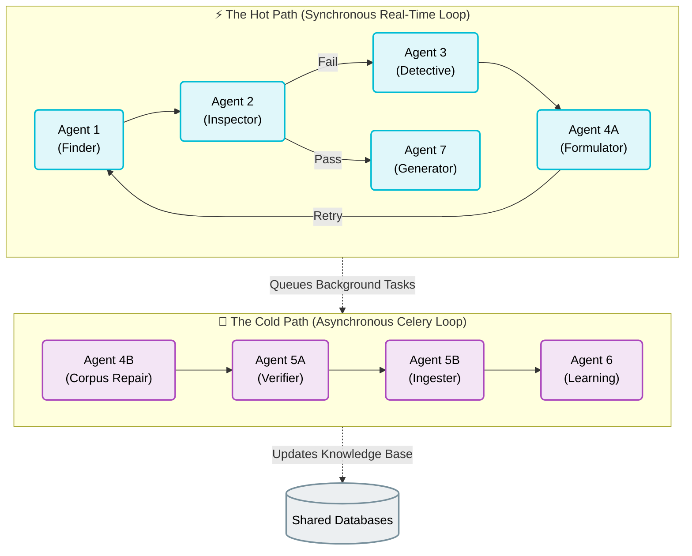

---

## The Hot Path

### Query Classification and Domain Check

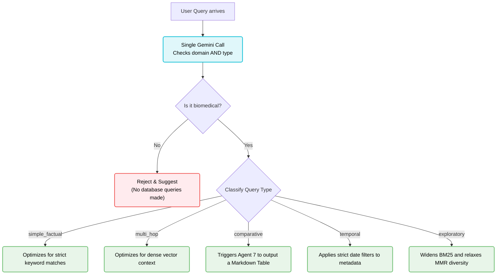

### The Semantic Cache

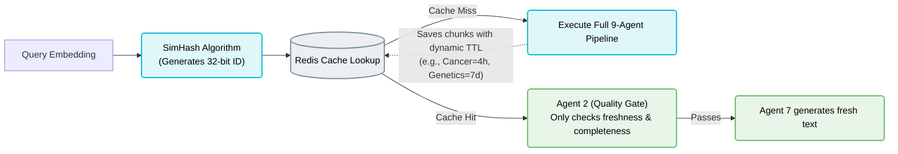

### Agent 1 — Retrieval

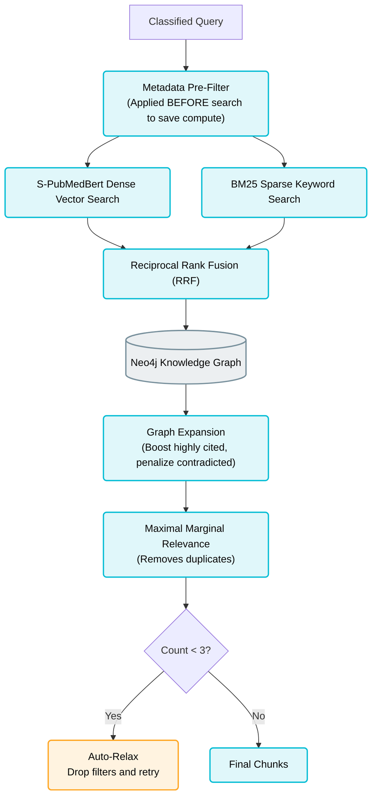

### Agent 2 — Quality Gate

| Check | What it tests | Blocking? | On fail |
|---|---|---|---|
| Relevance | Does the chunk directly answer the user's intent? | Yes | Agent 3 Diagnosis |
| Completeness | Do we have the full picture or just partial fragments? | Yes | Agent 3 Diagnosis |
| Freshness | Is the publication date acceptable for this specific topic? | No | Triggers Live Fetch |
| Calibration | Should we trust this score based on historical performance? | No | Lowers confidence |
| Contradiction | Do the retrieved papers disagree with each other? | No | Alerts Agent 7 |

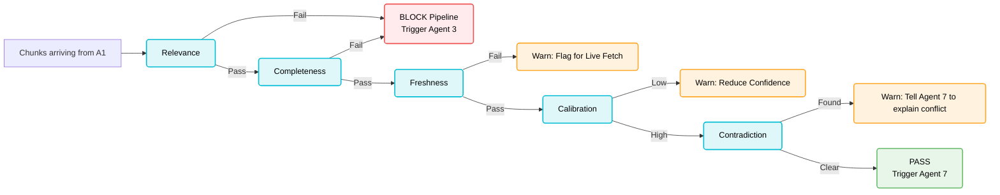

### The Repair Cycle

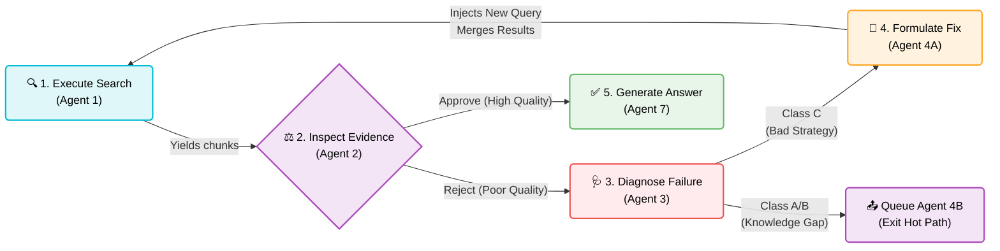

### Agent 7 — Generator

Agent 7 receives:
- The verified chunks that passed Agent 2
- The exact query
- Any contradiction warnings
- The calibrated confidence score

| Query type | Detected format |
|---|---|
| comparative + 2 entities | Markdown Table (side-by-side comparison) |
| "list" / "side effects" | Numbered List with inline citations |
| "summarize" / "overview" | Structured Summary (Findings, Evidence, Limits) |
| everything else | Conversational Prose with inline citations |

---

## The Cold Path

### Agent 4B — Corpus Repair

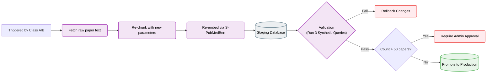

### Agent 5A — Verification Gate

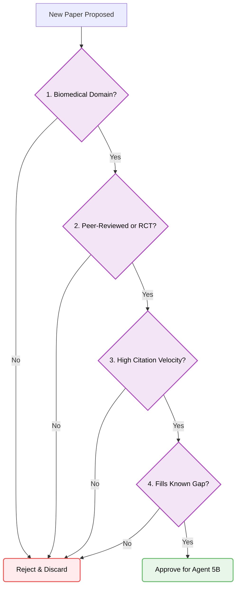

### Agent 6 — Self-Learning

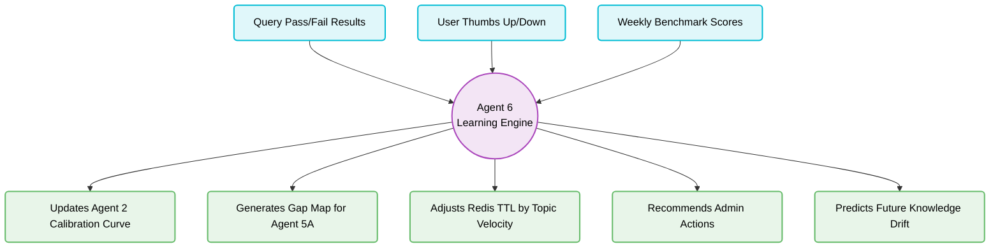

---

## The Self-Healing Loop

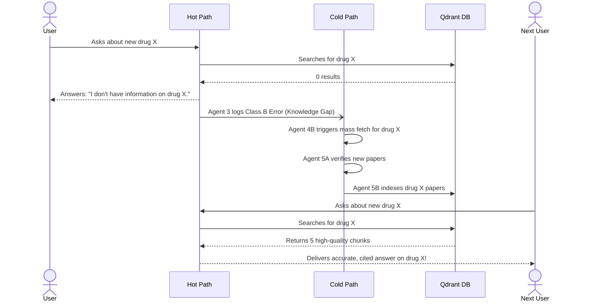

---

## Data Architecture

### Four Databases

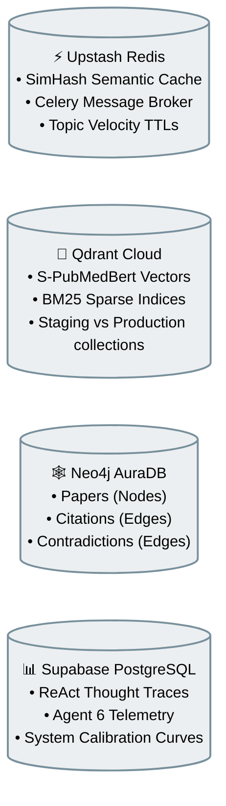

### The Four-Level Chunk Hierarchy

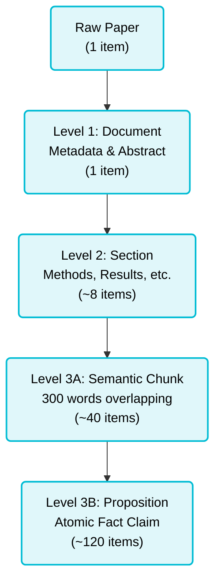

---

## ReAct Thought Traces

Every agent exposes its internal logic in real-time using the OBS/THK/ACT/OUT paradigm (Observe, Think, Act, Output). This guarantees absolute transparency.

**Agent 2 Example:**
```text
OBS  Received 5 chunks. Query asks for pembrolizumab side effects.
THK  Relevance is high. I need to check freshness because immunotherapy changes fast.
ACT  Evaluating freshness metadata. Oldest paper is 2021. Acceptable.
OUT  PASS. No contradictions detected. Proceed to Agent 7.
```

---

## API Reference

| Method | Path | Purpose |
|---|---|---|
| POST | `/chat` | Submits a query and returns the final JSON response |
| GET | `/stream` | Connects to SSE endpoint for live ReAct thought traces |
| POST | `/feedback` | Submits thumbs up/down for Agent 6 processing |
| GET | `/health` | Verifies connections to all 4 databases |

---

## Scheduled Jobs

| Job | Schedule | Purpose |
|---|---|---|
| Weekly benchmark | Sunday 2am | Track system improvement over time (86.7% baseline) |
| Daily Agent 6 insights | Daily 6am | Generate recommendations based on yesterday's telemetry |
| Freshness sweep | Every 3 days | Flag stale vector clusters for Agent 4B update |
| Daily paper monitor | Daily 4am | Check PubMed RSS for highly cited new relevant papers |
| Gap-targeted sweep | Sunday 3am | Find and ingest papers for known user knowledge gaps |
