# Self-Learning and Self-Healing RAG — Architecture

Technical reference for engineers who want to understand exactly how the system works.

---

## 1. Holistic System Architecture

This is the complete bird's-eye view of the system, showing how the frontend, backend, 9 autonomous agents, and 4 specialized databases interact.

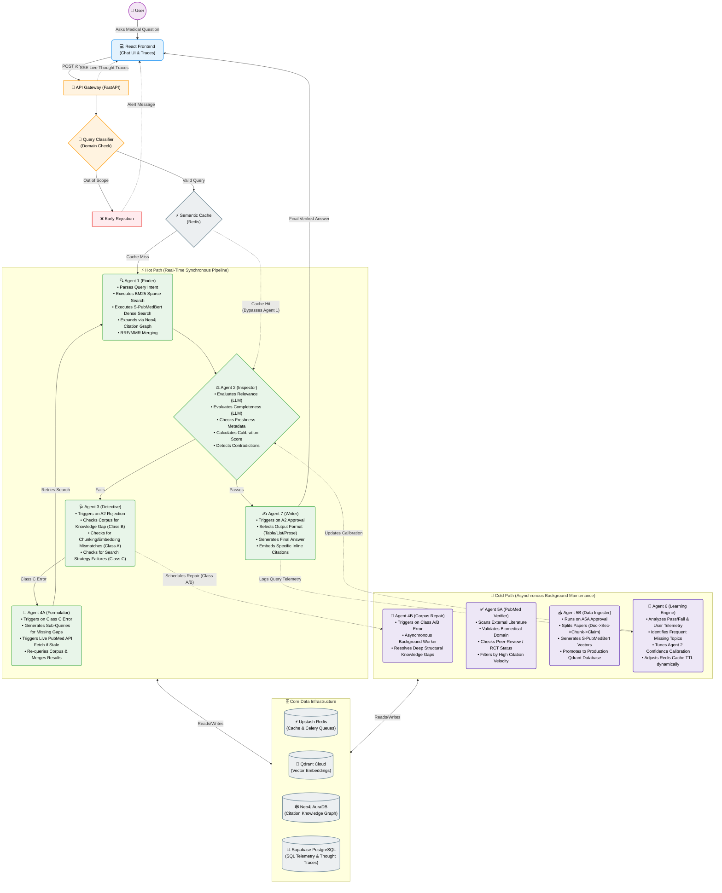

---

## 2. Frontend to Backend Data Flow (Sequence Diagram)

This diagram illustrates how the system streams ReAct thought traces to the UI in real-time before generating the final answer.

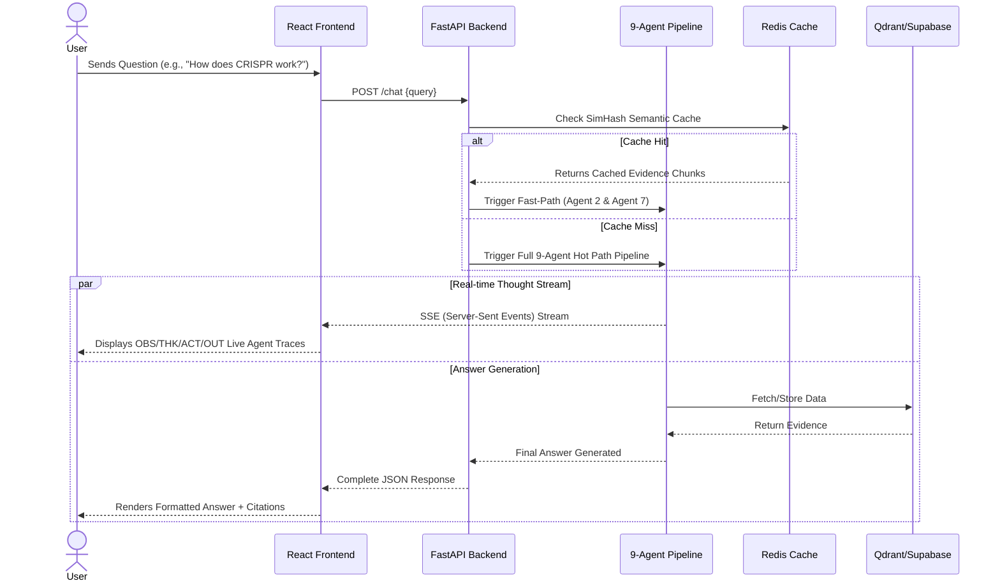

---

## 3. Query Classification and Domain Check

The first thing that happens when you ask a question. One Gemini call does both jobs simultaneously.

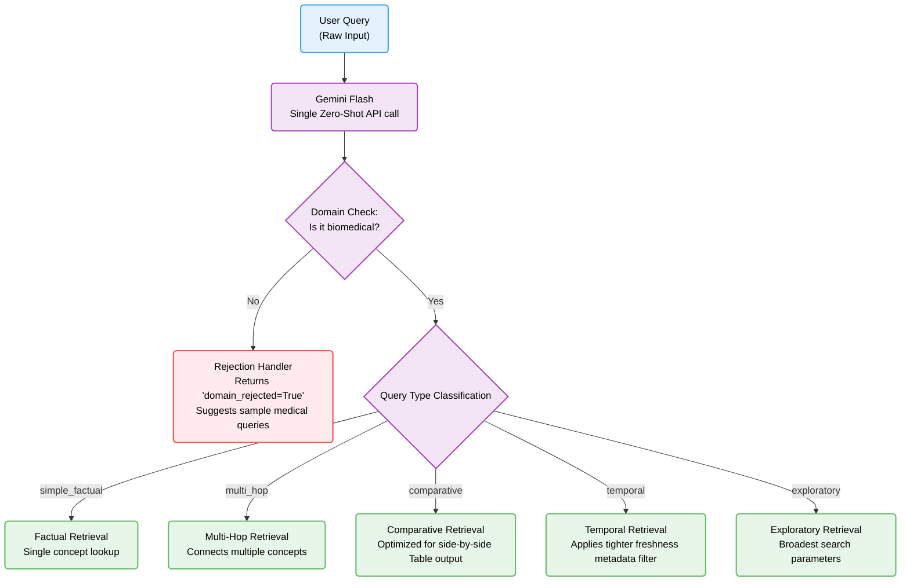

---

## 4. Agent 1 — Hybrid Retrieval Mechanics (RRF + MMR)

Agent 1 uses a sophisticated hybrid search to guarantee high-quality retrieval.

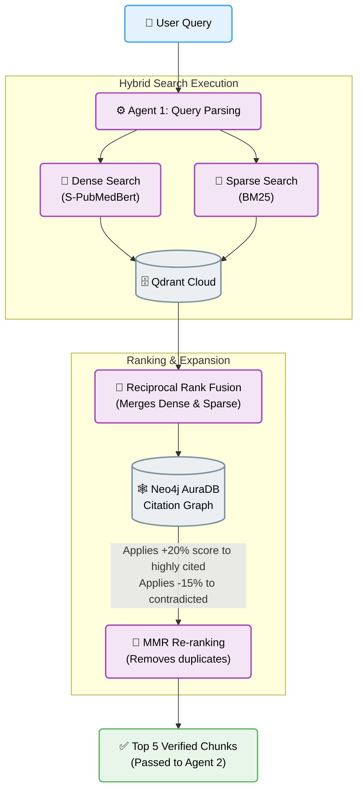

---

## 5. Neo4j Knowledge Graph Expansion

During retrieval, Agent 1 utilizes Neo4j to find hidden connections via citation networks.

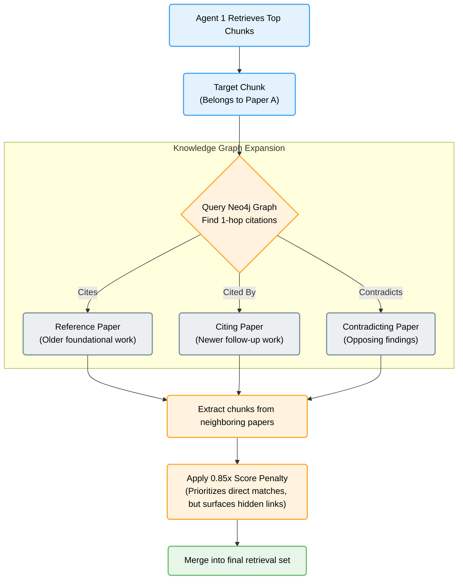

---

## 6. Agent 2 — Quality Gate

The most important agent. Nothing reaches Agent 7 without passing here.

| Check | Method | Blocking? | On fail |
|-------|--------|-----------|---------|
| Relevance | Gemini Flash scores each chunk | Yes | Enter repair cycle |
| Completeness | Gemini Flash checks full coverage | Yes | Enter repair cycle |
| Freshness | Metadata analysis, no LLM | No | Set live_fetch flag |
| Calibration | Read Agent 6 curves from Supabase | No | Adjust confidence |
| Contradiction | Gemini Flash compares chunks | No | Flag for Agent 7 |

---

## 7. Agent 3 — Root Cause Classifier

Runs when Agent 2 fails. Five diagnostic tests:

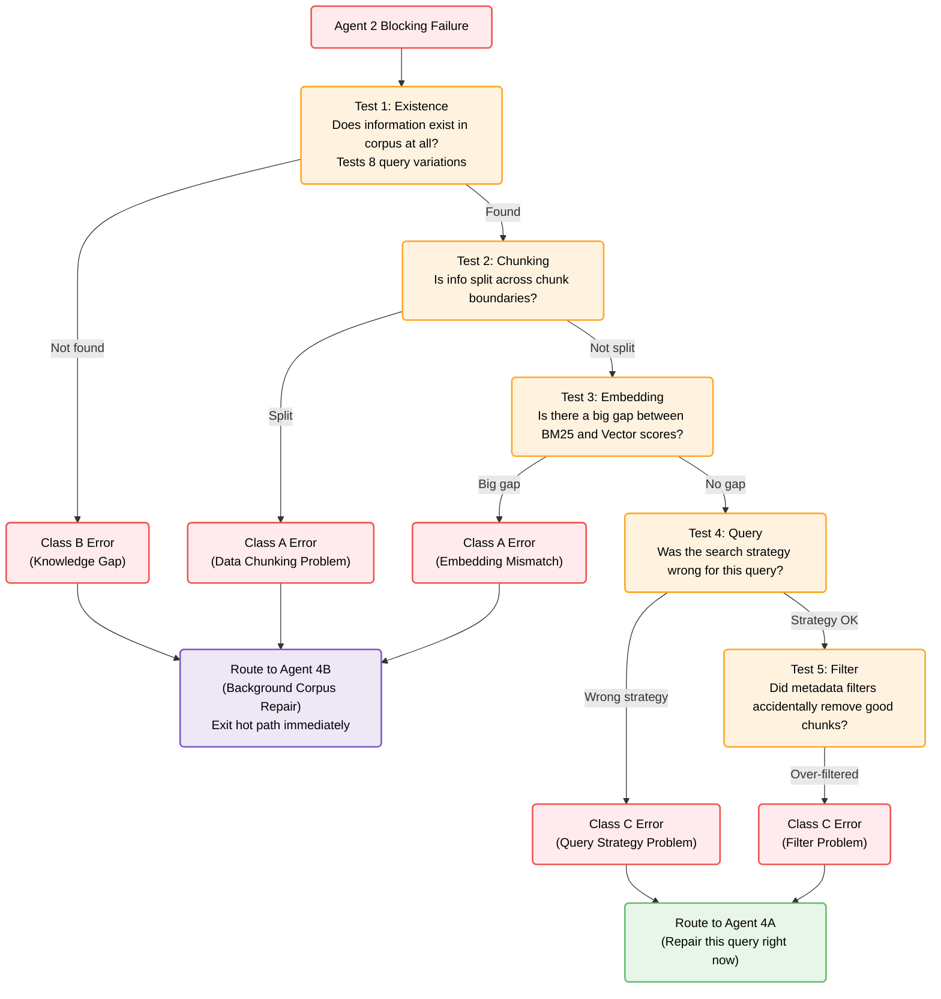

---

## 8. Celery Worker Queue Architecture (The Cold Path)

How background tasks are handled using Redis and Celery without blocking the user.

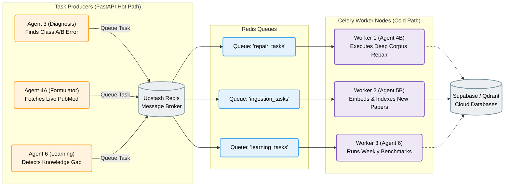

---

## 9. Agent 4A — Formulator

Handles Class C failures (query problems). Gets another chance to find the right evidence.

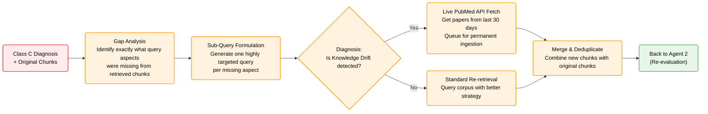

---

## 10. Agent 6 — Learning Architecture

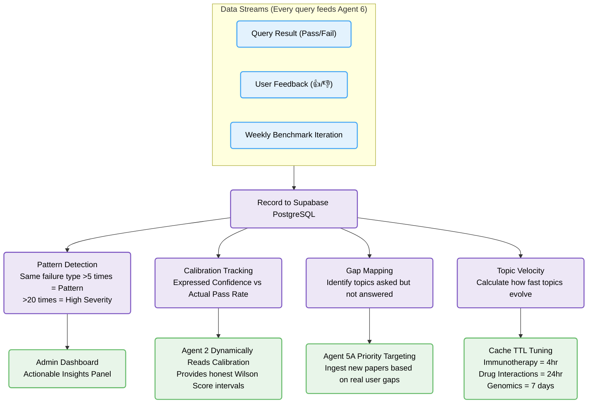

---

## 11. Agent 7 — Generator

Produces the final answer. Receives everything the pipeline discovered.

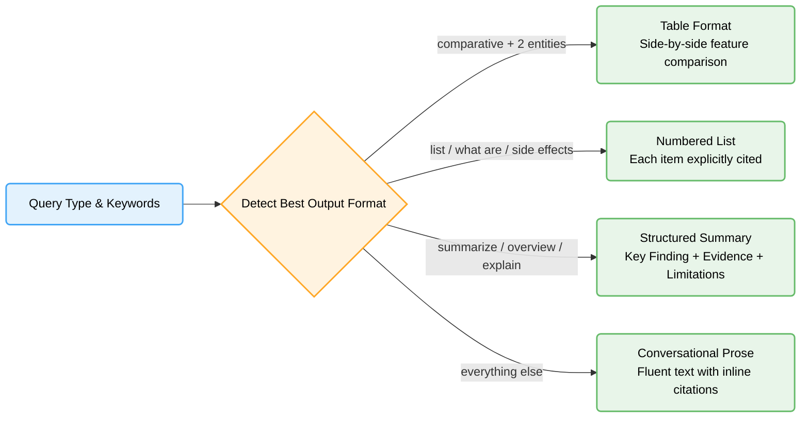

---

## 12. Semantic Cache

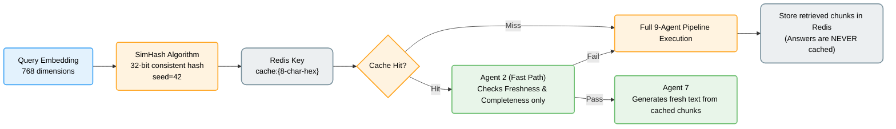
