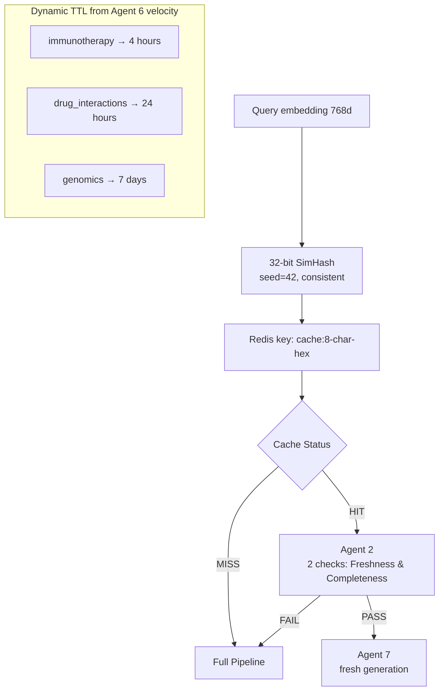

# FailureRAG — Architecture Reference

## System Boundaries

Two parallel loops never block each other.

```
HOT PATH (synchronous — under 8s P95)
  User → Cache → Agent 1 → Agent 2 → [Cycle] → Agent 7 → User

COLD PATH (async — Celery workers)
  Agent 4B | Agent 5A | Agent 5B | Agent 6
```

## Semantic Hash Cache



## Metadata Pre-Filter (Applied Before Vector Search)

```
Query Type     │ Filter Conditions          │ Safeguard
───────────────┼────────────────────────────┼──────────────────
simple_factual │ topic_cluster match         │ <3 chunks → relax
multi_hop      │ topic_cluster, loose date   │ <3 → remove date
comparative    │ topic_cluster only          │ <3 → broaden
temporal       │ cluster+date+freshness>0.5  │ <3 → live fetch
exploratory    │ minimal — cluster only      │ <3 → no filter
```

## Agent 2 — Five Checks

```
All pre-generation. Nothing reaches Agent 7 without passing.

① Retrieval Relevance
  LLM: Gemini Flash per chunk
  Pass: >= 3 of 5 chunks relevant
  Fail: → BLOCKING — enter repair cycle

② Completeness Grounding  
  LLM: Gemini Flash on all chunks together
  Pass: query fully answerable from chunks
  Fail: → BLOCKING — enter repair cycle
  Gaps stored for Agent 7 to acknowledge

③ Freshness
  No LLM — pure metadata analysis
  Pass: enough fresh chunks for topic velocity
  Fail: → NON-BLOCKING — sets live_fetch_needed
  Agent 4A triggered for knowledge_drift root cause

④ Calibration
  No LLM — Supabase lookup
  Reads Agent 6 calibration curves dynamically
  Falls back to corpus-count tiers if no data
  Always passes — adjusts confidence recommendation

⑤ Cross-Chunk Contradiction
  LLM: Gemini Flash comparison
  Only runs if 3+ chunks retrieved
  Always passes — flags for Agent 7 to surface
  Creates Neo4j CONTRADICTS relationship
```

## A2→A3→A4A Repair Cycle

```
┌─────────────────────────────────────────────────┐
│              REPAIR CYCLE                       │
│                                                 │
│  Agent 3 — 5 Diagnostic Tests                   │
│  ┌─────────────────────────────────────────┐    │
│  │ T1: Existence — 8 alternative phrasings │    │
│  │ T2: Chunking — check adjacent chunks    │    │
│  │ T3: Embedding — BM25 vs vector gap      │    │
│  │ T4: Query — expansion/strategy failure  │    │
│  │ T5: Metadata — filters removed valid    │    │
│  └─────────────────────────────────────────┘    │
│         │              │                        │
│      Class C        Class A/B                   │
│         │              │                        │
│         ▼              ▼                        │
│    Agent 4A        EXIT CYCLE                   │
│    ┌──────────┐    Queue 4B async               │
│    │Gap anal. │    Agent 7 + flag               │
│    │Coverage  │    User not blocked             │
│    │map       │                                 │
│    │Sub-query │                                 │
│    │formulate │                                 │
│    │Strategy  │                                 │
│    │select    │                                 │
│    └────┬─────┘                                 │
│         │                                       │
│         ▼                                       │
│    Agent 1 re-retrieves                         │
│    MERGE + DEDUPLICATE                          │
│    Agent 2 re-evaluates                         │
│    Max 2 iterations total                       │
└─────────────────────────────────────────────────┘
```

## Agent 6 — Learning Architecture

```
INPUTS (every query):
  Query result → observe_query_result()
  User rating → observe_user_feedback()
  Ingestion event → observe_ingestion_event()

OUTPUTS:

  1. Failure Patterns
     → Admin dashboard insights
     → Strategy recommendations

  2. Calibration Curves (per cluster)
     → Agent 2 reads dynamically
     → Confidence scores improve over time
     → User feedback: 2× weight vs agent signal

  3. Coverage Gap Map
     → Agent 5A ingestion priority
     → Query suggestions when gap hit

  4. Topic Velocity
     → CacheManager dynamic TTL
     → High velocity = shorter cache life

  5. Predictions
     → Freshness decline forecast
     → Query volume growth trends
     → Benchmark improvement forecast
     → Calibration drift alerts
```

## Selective Ingestion — Decision Tree

```
New paper arrives (from live fetch or monitor)
              │
              ▼
       Agent 5A Check 1
       Domain filter
       (embedding vs cluster centroids)
              │
         Pass│    Reject → DISCARD
              │
              ▼
       Agent 5A Check 2
       Corpus relationship:
         A. Contradiction detected?
         B. Fills coverage gap?
         C. Year >= 2022?
              │
         Any │yes    All no → DISCARD
              │
              ▼
       Agent 5A Check 3
       Evidence quality
       (assigns level: RCT/review/cohort/other)
              │
              ▼
       Citation Velocity
       Semantic Scholar API
       >= 50 citations → HIGH priority
       >= 10 + year>=2021 → MEDIUM
              │
              ▼
       Ingestion Rules (any one sufficient):
         ① Contradiction detected
         ② Fills Agent 6 gap (query_count >= 3)
         ③ High citation velocity
         ④ Matches query patterns
         ⑤ Quality recent paper
              │
         Pass│    Fail → DISCARD
              │
              ▼
       Agent 5B — Hierarchical Chunking
       L1 → L2 → L3A → L3B
              │
              ▼
       Staging validation (3 query types)
              │
         Pass│    Fail → ROLLBACK
              │
       >50 papers? → Admin approval
              │
              ▼
       Production promotion
       Neo4j graph updated
       Cache invalidated
```

## Pydantic Model Hierarchy

```
agents/models.py — Single source of truth

PipelineState          (flows through hot path)
  ├── QueryClassification
  ├── FilterConfig
  ├── RetrievalResult[]
  ├── Agent2Result
  │     └── EvaluationResult[]
  ├── CycleResult
  │     ├── DiagnosisResult[]
  │     └── RetrievalResult[] (merged)
  └── GeneratedResponse
        └── ClaimProvenance[]

ConversationSession
  └── ConversationTurn[]

Agent6Insight
StrategyRecommendation
VerificationResult
FormulationResult
  └── SubQuery[]
```

## Database Schema Overview

```
QDRANT CLOUD
  failurerag_document      L1 — full paper vectors
  failurerag_section       L2 — section vectors
  failurerag_semantic      L3A — chunk vectors
  failurerag_proposition   L3B — proposition vectors
  *_staging                Repair validation collections

SUPABASE POSTGRESQL
  ingestion_logs           Paper provenance
  agent_failures           Repair cycle failures
  repair_history           Completed repairs
  repair_queue             Admin approval pending
  agent6_patterns          Failure pattern detection
  agent6_gaps              Coverage gap map
  agent6_calibration       Per-cluster curves
  agent6_insights          Actionable recommendations
  strategy_recommendations Parameter change proposals
  benchmark_questions      50 QA pairs
  benchmark_results        Weekly runs
  user_feedback            Thumbs up/down
  user_profiles            Per-user learning

NEO4J AURADB
  (Paper) nodes            All corpus papers
  [:BELONGS_TO]            → (TopicCluster)
  [:CONTRADICTS]           Detected conflicts
  [:SUPERSEDES]            Knowledge updates

UPSTASH REDIS
  session:{id}             Conversation (2hr TTL)
  cache:{simhash}          Retrieved chunks (dynamic)
  topic_model:{id}         Session entities (2hr)
  Celery queues            high/medium/low_priority
```

## API Reference

```
POST   /chat                    Main chat endpoint
POST   /chat/feedback           Thumbs up/down
GET    /chat/stream             SSE agent activity

GET    /health                  System health

GET    /admin/stats             Corpus + Agent 6 data
GET    /admin/corpus-health     Collection stats
GET    /admin/pending-approvals Repair queue
POST   /admin/approve-repair/{id}
GET    /admin/benchmark-trend   Weekly improvement
GET    /admin/latest-benchmark  Most recent run
GET    /admin/strategy-recommendations
POST   /admin/approve-strategy/{id}
GET    /admin/repair-history
```

## Scheduled Jobs

```
Job                  Schedule        Purpose
─────────────────────────────────────────────────
Weekly benchmark     Sunday 2am      Track improvement
Daily insights       Daily 6am       Agent 6 generation
Freshness sweep      Every 3 days    Stale cluster alert
Daily monitor        Daily 4am       New paper detection
Gap-targeted sweep   Sunday 3am      Gap-fill ingestion
```
