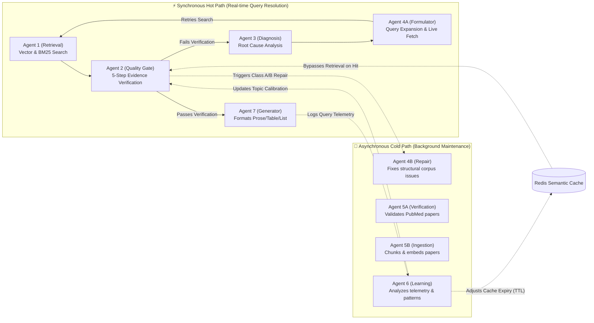
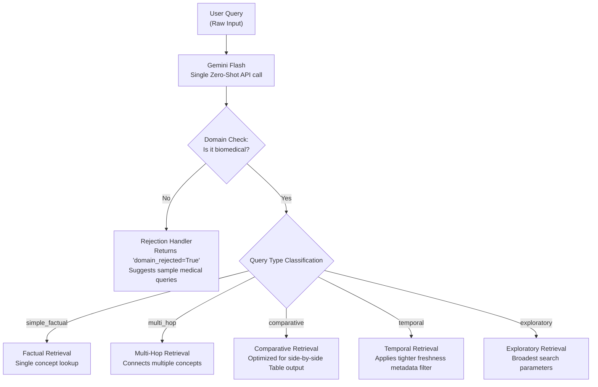
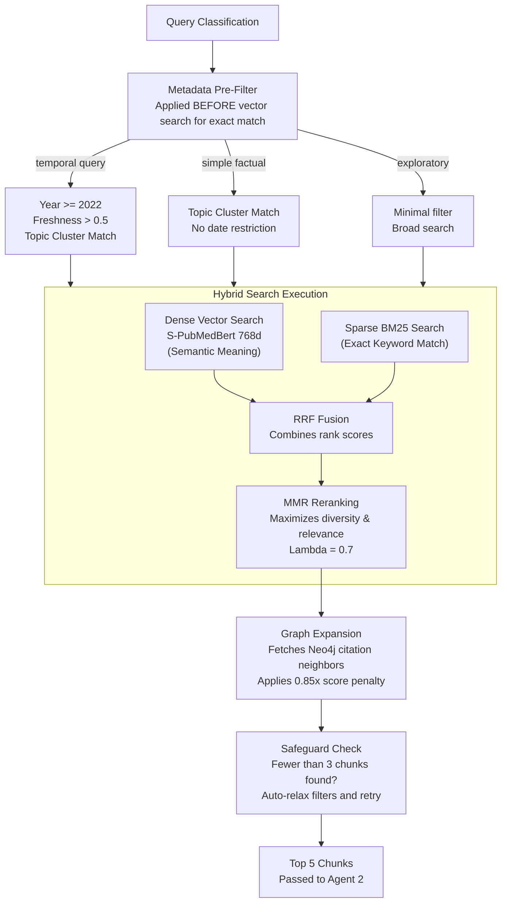
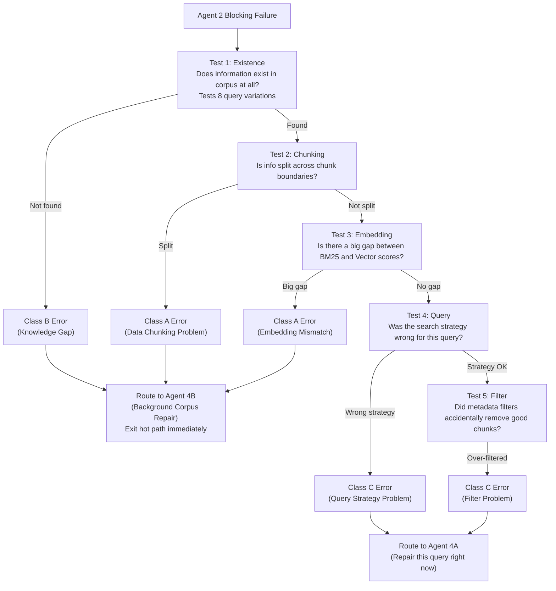
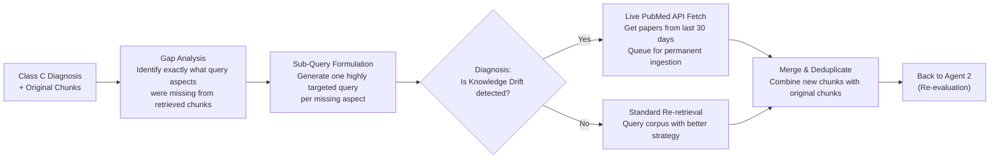
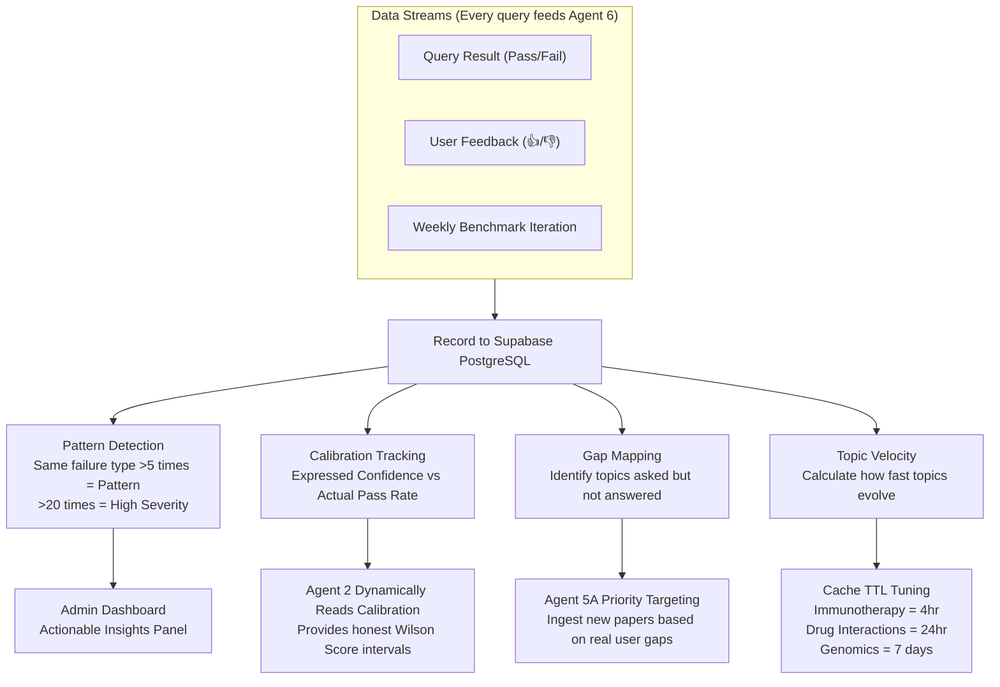
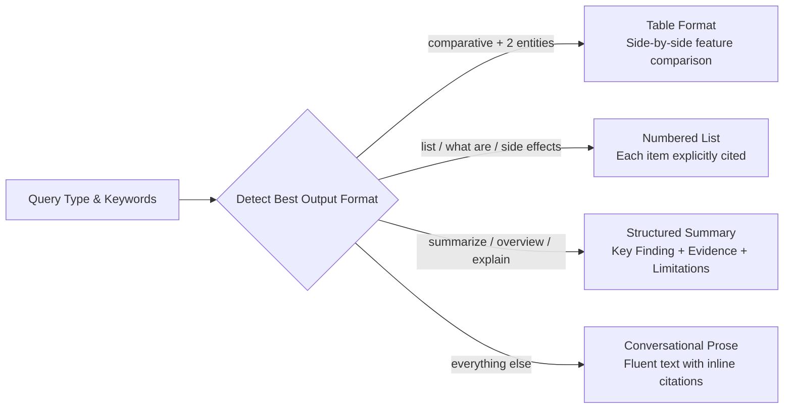
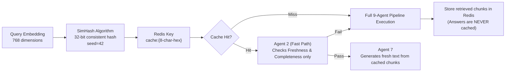

# Self-Learning and Self-Healing RAG — Architecture

Technical reference for engineers who want to understand exactly how the system works.

---

## System Overview

Two parallel loops run at all times:

**Hot path** — synchronous, handles your query in real time (target: under 15 seconds)

**Cold path** — asynchronous Celery workers, keeps the corpus healthy in the background

---

## Query Classification and Domain Check

The first thing that happens when you ask a question. One Gemini call does both jobs simultaneously.

---

## Agent 1 — Retrieval

---

## Agent 2 — Quality Gate

The most important agent. Nothing reaches Agent 7 without passing here.

| Check | Method | Blocking? | On fail |
|-------|--------|-----------|---------|
| Relevance | Gemini Flash scores each chunk | Yes | Enter repair cycle |
| Completeness | Gemini Flash checks full coverage | Yes | Enter repair cycle |
| Freshness | Metadata analysis, no LLM | No | Set live_fetch flag |
| Calibration | Read Agent 6 curves from Supabase | No | Adjust confidence |
| Contradiction | Gemini Flash compares chunks | No | Flag for Agent 7 |

**Calibration detail:**
- Reads actual pass rate history from Supabase per topic cluster
- User thumbs up/down weighted 2× vs agent signal
- Returns confidence interval not just a point estimate
- Falls back to corpus-size tiers if no history yet

---

## Agent 3 — Root Cause Classifier

Runs when Agent 2 fails. Five diagnostic tests:

---

## Agent 4A — Formulator

Handles Class C failures (query problems). Gets another chance to find the right evidence.

---

## Agent 6 — Learning Architecture

---

## Agent 7 — Generator

Produces the final answer. Receives everything the pipeline discovered.

**Inputs from pipeline:**
- Verified chunks with quality scores
- Coverage map — which chunk answers which part of the query
- Freshness score per chunk
- Contradiction flags
- Calibrated confidence with interval
- Conversation history (last 6 turns verbatim + summary of older turns)
- Gap acknowledgment if some aspects not covered

**Output format detection:**

**Claim provenance:** After generating, Agent 7 uses Gemini to link every specific fact in the answer back to the exact chunk that supports it. Each claim shows paper ID, year, journal, and a source quote.

---

## Semantic Cache

**Important:** The cache stores retrieved chunks not generated answers. Agent 7 always generates fresh. This means context-aware conversation always works correctly.

---

## ReAct Thought Traces

Every key decision in every agent is logged in OBS/THK/ACT/OUT format:

- **OBS** — what the agent observed (data, scores, counts)
- **THK** — what it reasoned (why this matters, what it implies)
- **ACT** — what action it decided to take
- **OUT** — what the outcome was

Stored in Supabase `thought_traces` table. Visible in transparency mode with "REASONING ON" toggle.

---

## Data Models — Pydantic

All inter-agent data uses Pydantic BaseModel for type safety. Defined in `agents/models.py`.

Key models:

| Model | Used by | Purpose |
|-------|---------|---------|
| PipelineState | Hot path | Flows through all agents |
| QueryClassification | Agent 1 | Query type + domain check |
| RetrievalResult | Agent 1→2 | Single retrieved chunk |
| Agent2Result | Agent 2→3/7 | 5 check results + confidence |
| DiagnosisResult | Agent 3→4A | Root cause + failure class |
| FormulationResult | Agent 4A→1 | Sub-queries + live fetch |
| CycleResult | Repair→7 | Final merged chunks |
| GeneratedResponse | Agent 7→API | Answer + citations + provenance |
| ThoughtTrace | All agents | OBS/THK/ACT/OUT record |

---

## API Endpoints

| Method | Path | Purpose |
|--------|------|---------|
| POST | /chat | Main chat endpoint |
| POST | /chat/feedback | Thumbs up/down |
| GET | /chat/stream | SSE live agent feed |
| GET | /health | System health check |
| GET | /admin/stats | Corpus + learning data |
| GET | /admin/corpus-health | Collection sizes |
| GET | /admin/pending-approvals | Repair queue |
| POST | /admin/approve-repair/{id} | Approve or reject |
| GET | /admin/benchmark-trend | Weekly scores |
| GET | /admin/latest-benchmark | Most recent run |
| GET | /admin/strategy-recommendations | Parameter suggestions |

---

## Scheduled Jobs

| Job | Schedule | Purpose |
|-----|---------|---------|
| Weekly benchmark | Sunday 2am | Track improvement over time |
| Daily Agent 6 insights | Daily 6am | Generate recommendations |
| Freshness sweep | Every 3 days | Flag stale clusters |
| Daily paper monitor | Daily 4am | Check for new relevant papers |
| Gap-targeted sweep | Sunday 3am | Find papers for known gaps |
