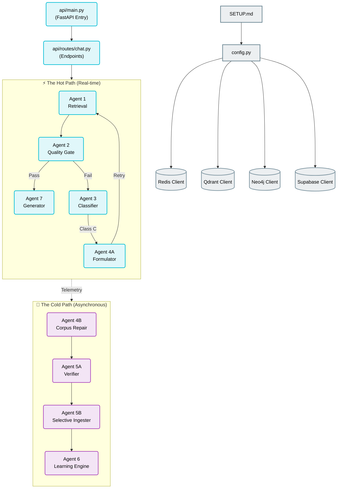

# 🧬 Self-Healing RAG (FailureRAG) — Structured Reading Plan

Welcome to the **Self-Learning and Self-Healing RAG** (FailureRAG) codebase! Because this application was built using a *vibe coding* paradigm, it has a highly modern, reactive, and modular architecture. Systems are constructed to auto-correct themselves asynchronously without interrupting the real-time synchronous "hot path" that serves the user.

This document serves as your structured study guide and curriculum. It is broken down into **6 logical modules** to guide your exploration of the repository from startup and core databases to the individual agent systems.

---

## 🗺️ Visual Architecture Map

---

## 📁 Module 1: Project Setup, Config & Entry Points

Before looking at agents, we must see how the application boots, registers connections to the four cloud databases, and schedules background tasks.

### 📂 Key Files to Read
* [SETUP.md](file:///c:/Users/mahip/OneDrive/Desktop/SelfLearning_Rag/SETUP.md) — Environmental guidelines and accounts setup.
* [config.py](file:///c:/Users/mahip/OneDrive/Desktop/SelfLearning_Rag/config.py) — Centralized configuration parsing environment variables.
* [api/main.py](file:///c:/Users/mahip/OneDrive/Desktop/SelfLearning_Rag/api/main.py) — The FastAPI server initialization, database health checks, and scheduled jobs.

### 🎯 Main Objective
See how FastAPI sets up its lifecycle hook (`lifespan`) to verify connections to **Qdrant**, **Supabase**, **Neo4j**, and **Redis** synchronously before taking incoming traffic, and how background task schedulers are kicked off.

### 💡 The "Why" (Detailed Architecture Explanations)
* **Four Independent Databases**: 
  * **Redis**: Used for high-speed cache storage of semantic chunk embeddings (via SimHash comparison) and background task coordination.
  * **Qdrant**: High-density vector storage hosting raw text embeddings (generated via `BiomedicalEmbedder`) alongside sparse indices for hybrid dense/sparse keyword matching.
  * **Neo4j**: Represents our biomedical knowledge graph. We use this to run graph-based context expansion (such as discovering if two papers belong to a citation loop, or if an author is highly cited) and proactive contradiction checks.
  * **Supabase**: Relational storage for logging developer telemetry (e.g., `agent_failures`, `user_feedback`, and `thought_traces` representing intermediate ReAct thought chains).
* **lifespan Startup Verification**: If any database credentials in `keys.txt` are incorrect, the backend fails to start immediately on the lifespan hook, preventing half-broken deployments.

### 🏆 Module Challenge
Open `api/main.py` and inspect how `AsyncIOScheduler` schedules jobs. Which jobs run daily, and which ones run weekly? What is the purpose of the `freshness_sweep` job?

---

## 📁 Module 2: Database Clients & Graph-Vector Grounding

Next, read how the application reads from and writes to the complex database setup.

### 📂 Key Files to Read
* [database/qdrant_client.py](file:///c:/Users/mahip/OneDrive/Desktop/SelfLearning_Rag/database/qdrant_client.py) — Connects to the vector collection, defining dense/sparse hybrid search queries.
* [database/neo4j_client.py](file:///c:/Users/mahip/OneDrive/Desktop/SelfLearning_Rag/database/neo4j_client.py) — Handles Cypher queries for citation metrics, co-author patterns, and contradiction loops.
* [database/supabase_client.py](file:///c:/Users/mahip/OneDrive/Desktop/SelfLearning_Rag/database/supabase_client.py) — Interacts with PostgreSQL schema tables for agent telemetry logs.
* [database/redis_client.py](file:///c:/Users/mahip/OneDrive/Desktop/SelfLearning_Rag/database/redis_client.py) — Fast cache reads/writes.

### 🎯 Main Objective
Observe how we construct queries to pull records from Qdrant, and how Neo4j queries citation data to enrich Qdrant vector outputs.

### 💡 The "Why"
* **Why Graph + Vector? (Hybrid Grounding)**: Standard vector databases look only at semantic similarities. However, in medicine, a paper's citation history, journal prominence, and clinical trial phase (Graph features) are critical indicators of scientific truth. By fusing vectors with Neo4j relationship traversals, we can boost reliable papers and flag highly contradicted ones.
* **Why Hybrid Search (Dense + Sparse)**: 
  * *Dense Search* (S-PubMedBert vectors) captures semantic synonyms (e.g., matching "cancer treatment" with "immunotherapy").
  * *Sparse Search* (BM25) captures exact drug names and chemical IDs (e.g., matching exact names like "Pembrolizumab" or "PD-1" that vector models might blur together).

---

## 📁 Module 3: The Synchronous Hot Path (FastAPI Routing)

This is the central backbone where queries flow through when a user sends a message.

### 📂 Key Files to Read
* [api/routes/chat.py](file:///c:/Users/mahip/OneDrive/Desktop/SelfLearning_Rag/api/routes/chat.py) — Serves both `/chat` (standard HTTP) and `/chat/stream` (Server-Sent Events for real-time thought trace streaming).
* [agents/models.py](file:///c:/Users/mahip/OneDrive/Desktop/SelfLearning_Rag/agents/models.py) — The strict Pydantic structures (`PipelineState`, `RetrievalResult`, `Agent2Result`, `GeneratedResponse`, `ThoughtTrace`) that lock down interfaces between agents.

### 🎯 Main Objective
Trace the sequential path of `chat_endpoint()`:
1. Load history & resolve follow-up queries.
2. Check the **Proactive Semantic Cache** in Redis.
3. Classify the query using Gemini.
4. Run Retrieval (Agent 1).
5. Quality-inspect via the Quality Gate (Agent 2).
6. If failed, trigger the **Repair Cycle** (Agent 3 + Agent 4A).
7. Generate response strictly bounded by evidence (Agent 7).

### 💡 The "Why"
* **The `PipelineState` Pattern**: Passing a single, structured, type-safe memory object (`PipelineState`) through the hot path prevents agents from re-calculating values. For example, if Agent 1 determines the query is a `comparative` type, that value is saved in the state, so Agent 7 knows to output a Markdown Table without re-evaluating.
* **Caching Chunks, Not Text**: Caching raw AI answers is dangerous in medical RAG because answers go stale, and they bypass safety checks. Instead, we cache the *retrieved database chunks*. This means we get the speed of cache hits, but **Agent 2 still performs freshness and validation checks** on cached chunks, guaranteeing safety.

---

## 📁 Module 4: Agent 1 (Retrieval) & Agent 2 (Quality Gate)

Here is where the core RAG AI logic begins.

### 📂 Key Files to Read
* [agents/agent1_retrieval.py](file:///c:/Users/mahip/OneDrive/Desktop/SelfLearning_Rag/agents/agent1_retrieval.py) — Implements classification, metadata pre-filters, hybrid search, graph context expansion, MMR diversity, and "Auto-Relax".
* [agents/agent2_evaluator.py](file:///c:/Users/mahip/OneDrive/Desktop/SelfLearning_Rag/agents/agent2_evaluator.py) — Inspects retrieved evidence against five specific parameters (Relevance, Completeness, Freshness, Calibration, Contradiction).

### 🎯 Main Objective
See how Agent 1 pre-filters metadata prior to scanning vectors, and how Agent 2 performs checks on raw chunks before any answer is generated.

### 💡 The "Why"
* **Pre-Filtering vs. Post-Filtering**: If we run vector similarity first and then filter metadata post-retrieval (e.g., keeping only post-2023 papers), a query like "CRISPR 2024" might fetch 5 ancient papers from 2020 which the filter then deletes, leaving 0 chunks. Applying metadata pre-filtering guarantees we only search the valid subset.
* **Pre-Generation Evaluation**: Standard RAG generates an answer and then asks an LLM "is this correct?" Our Quality Gate evaluates the *source chunks*. If the source chunks are poor quality, irrelevant, or incomplete, the pipeline is blocked **before** wasting tokens and risking a hallucinated answer.
* **Auto-Relax**: If MMR diversity filtering or strict metadata constraints result in less than 3 relevant chunks, Agent 1 automatically drops the date constraints or relaxes diversity parameters, ensuring Agent 2 receives sufficient context.

---

## 📁 Module 5: Failure Diagnostics & Real-Time Healing (Agents 3 & 4A)

When evidence fails Agent 2's validation, the system enters self-healing mode.

### 📂 Key Files to Read
* [agents/agent3_classifier.py](file:///c:/Users/mahip/OneDrive/Desktop/SelfLearning_Rag/agents/agent3_classifier.py) — Diagnoses failures into Class A, B, or C.
* [agents/agent4a_formulator.py](file:///c:/Users/mahip/OneDrive/Desktop/SelfLearning_Rag/agents/agent4a_formulator.py) — Formulates sub-queries to retrieve missing data.
* [agents/repair_cycle.py](file:///c:/Users/mahip/OneDrive/Desktop/SelfLearning_Rag/agents/repair_cycle.py) — Manages the iterative retry loop.

### 🎯 Main Objective
Understand how Agent 3 runs tests to find out *why* the data failed, and how Agent 4A retrieves the missing gaps and fuses them with the original chunks.

### 💡 The "Why"
* **The Three Error Classes**:
  * **Class A (Boundary/Embedding Error)**: The data exists but is chunked/embedded poorly. This is routed to background repairs (Agent 4B).
  * **Class B (Knowledge Gap)**: The database is completely missing this information. Triggers asynchronous ingestion pipelines.
  * **Class C (Search Strategy Error)**: The retriever used the wrong search parameters or filters. Agent 4A triggers a **real-time repair** by executing reformulated searches.
* **Merge-Not-Replace**: When Agent 4A completes a repair, the new chunks are merged and deduplicated with the original ones. We never throw away partial successes.

---

## 📁 Module 6: Ingestion, Background Repair & Learning (Agents 4B, 5A, 5B, 6, 7)

This handles how new papers are evaluated and ingested, and how telemetry optimizes the system.

### 📂 Key Files to Read
* [ingestion/pipeline.py](file:///c:/Users/mahip/OneDrive/Desktop/SelfLearning_Rag/ingestion/pipeline.py) — The ingestion framework.
* [agents/agent5a_verifier.py](file:///c:/Users/mahip/OneDrive/Desktop/SelfLearning_Rag/agents/agent5a_verifier.py) — The verification gatekeeper for new papers.
* [agents/agent6_learning.py](file:///c:/Users/mahip/OneDrive/Desktop/SelfLearning_Rag/agents/agent6_learning.py) — The longitudinal learning engine.
* [agents/agent7_generator.py](file:///c:/Users/mahip/OneDrive/Desktop/SelfLearning_Rag/agents/agent7_generator.py) — Generates answers with strict claim provenance.

### 🎯 Main Objective
Observe the strict rules for peer-review validation and how Agent 6 reads relational telemetry to alter the system's confidence levels and caching rules.

### 💡 The "Why"
* **Domain & Quality Verification (Agent 5A)**: Before indexing clinical papers, the system runs checks ensuring the source is strictly biomedical, peer-reviewed, and carries high citation velocity, preventing garbage data ingestion.
* **Longitudinal Calibration (Agent 6)**: If users flag thumbs-down on queries in a particular cluster (e.g., drug interactions), Agent 6 calculates confidence bounds and updates Supabase calibration matrices so the Quality Gate adjusts its expectations dynamically.
* **Claim Provenance (Agent 7)**: Every claim is mapped back to the exact chunk ID and paper source, generating structured metadata tables or citation brackets. If a claim cannot be verified, it is omitted.

---

## 🏆 Your Roadmap to Master FailureRAG

Here is the ideal way to read through this project:
1. **Open and review the client modules** in `database/` to see the core database drivers.
2. **Read the API routing** in `api/routes/chat.py` to trace the hot path sequentially.
3. **Inspect the Core Agents** in sequence: `agent1_retrieval.py` ➡️ `agent2_evaluator.py` ➡️ `agent3_classifier.py` ➡️ `agent4a_formulator.py` ➡️ `agent7_generator.py`.
4. **Inspect the Background Engines**: `agent5a_verifier.py` ➡️ `agent6_learning.py`.

*If you have doubts at any stage, ask your AI partner for clarification, or run the slash command `/grill-me` to take a knowledge-check quiz on the module you just completed!*
