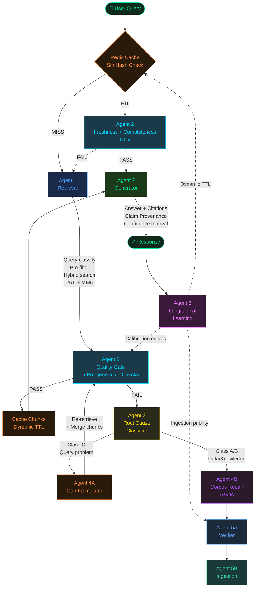
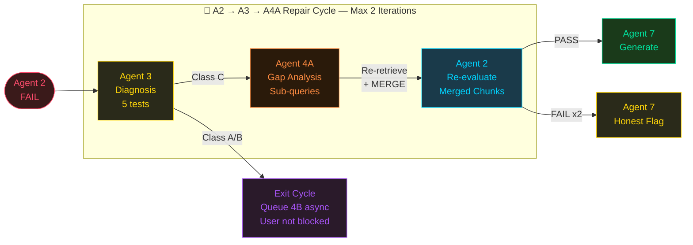
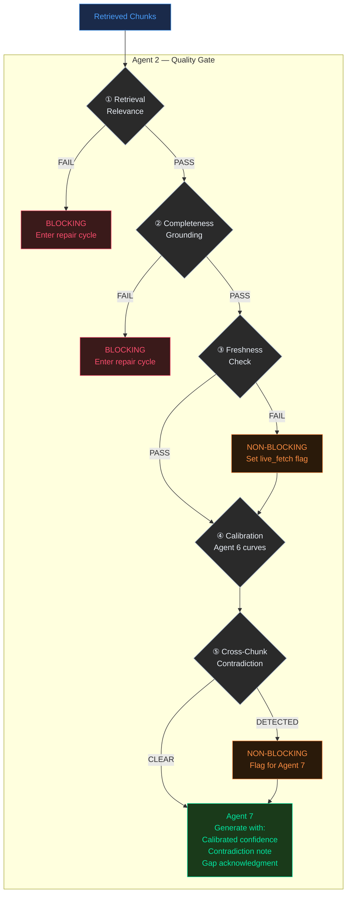
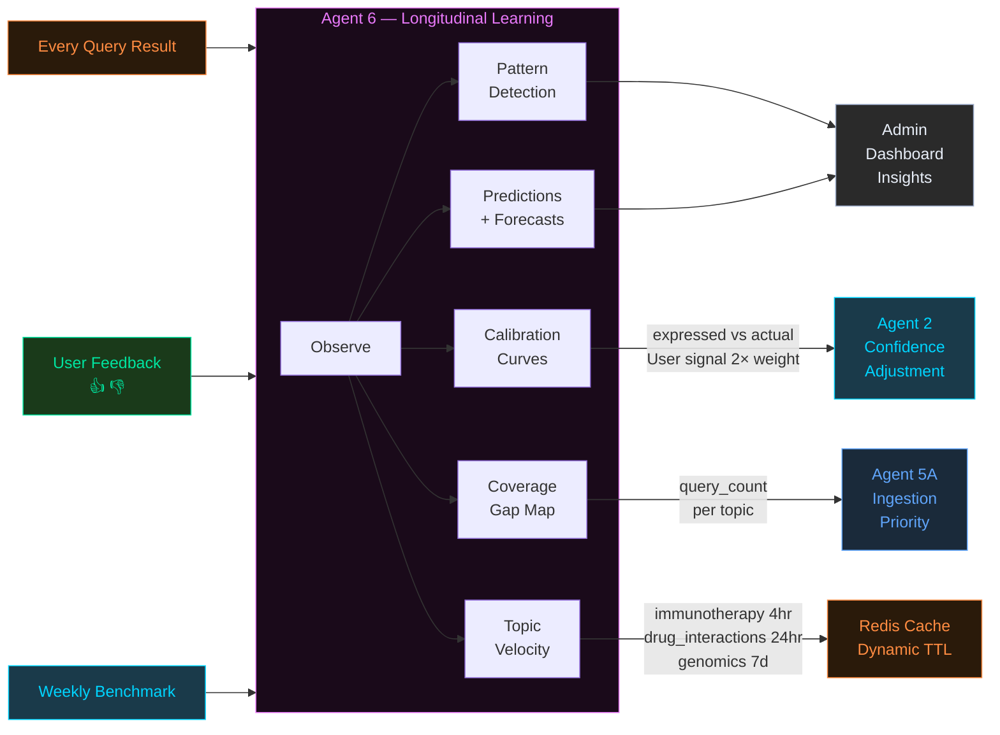
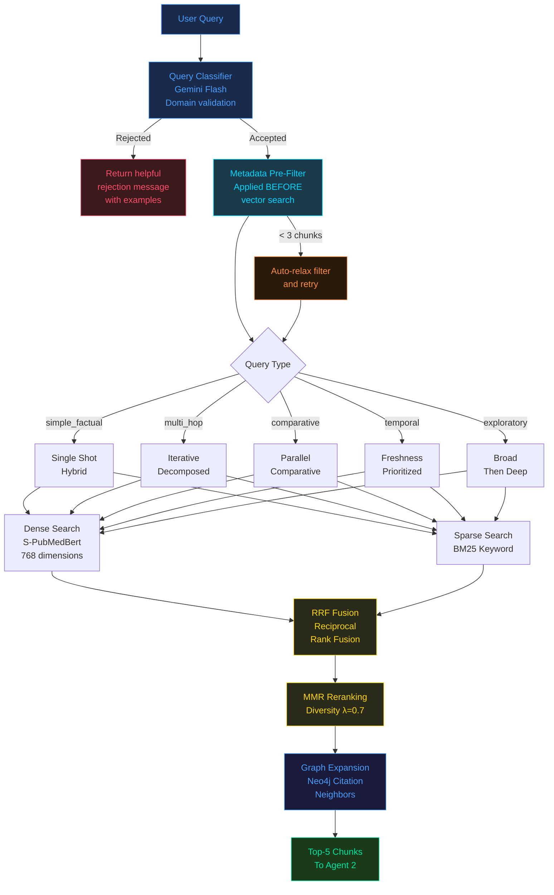
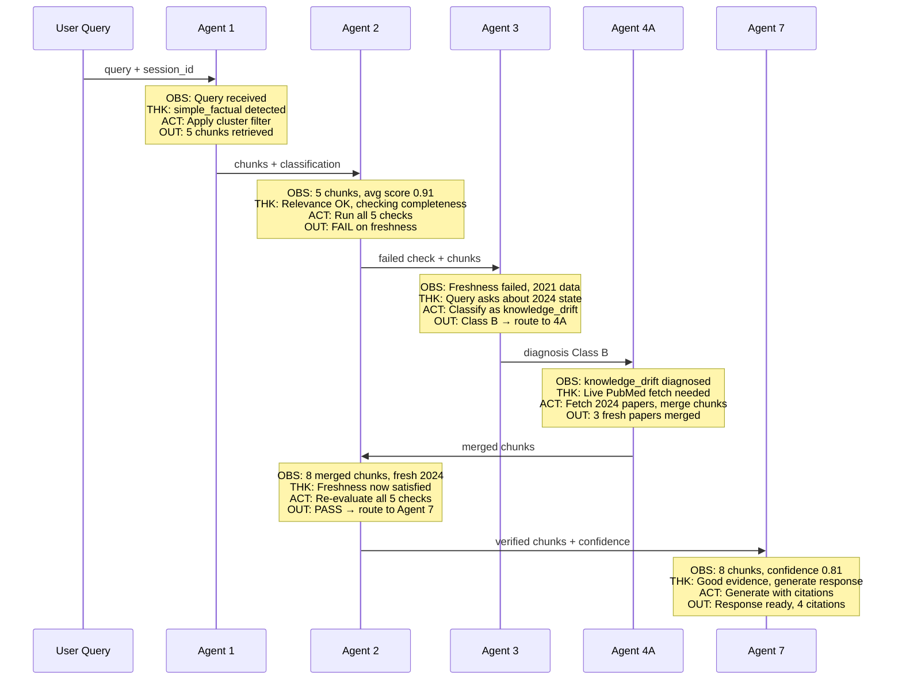

# FailureRAG

> **Self-healing, self-learning conversational RAG system over biomedical research literature**

A nine-agent autonomous system that detects its own retrieval failures, diagnoses root causes, repairs itself in real time, and gets measurably smarter with every query.

**86.7% benchmark pass rate** on 50 biomedical QA pairs out of the box — before any learning has occurred.

---

## What Makes This Different

Most RAG systems fail silently. FailureRAG fails loudly, diagnoses why, and fixes itself.

| Problem | FailureRAG Solution |
|---------|-------------------|
| Bad retrieval → confident wrong answer | Agent 2 evaluates chunks **before** any generation |
| Stale knowledge | Agent 2 detects freshness failure → Agent 4A fetches live from PubMed |
| Corpus gaps | Agent 6 tracks what users ask → drives selective ingestion |
| Confidence miscalibration | Agent 6 calibration curves → Agent 2 adjusts dynamically |
| Contradicting sources | Agent 2 detects → Agent 7 surfaces explicitly with citations |
| Off-topic questions | QueryClassifier rejects non-biomedical queries in same LLM call |

---

## System Architecture



---

## The Repair Cycle — Core Innovation



**Three exit conditions:**
1. Agent 2 passes → Agent 7 generates
2. Max 2 cycles → Agent 7 with honest gap flag
3. Class A/B diagnosis → exit immediately, queue Agent 4B async, user never waits

---

## Agent 2 — Five Pre-Generation Checks



---

## Agent 6 — Self-Learning Loops



---

## Retrieval Architecture



---

## Data Architecture

```mermaid
flowchart LR
    subgraph QDRANT ["Qdrant Cloud — Vector Store"]
        Q1[document\n~1,500 pts\nL1 full paper]
        Q2[section\n~4,700 pts\nL2 IMRAD]
        Q3[semantic\n~10,900 pts\nL3A chunks]
        Q4[proposition\n~5,500 pts\nL3B claims]
        Q5[staging × 4\nrepair validation]
    end

    subgraph SUPA ["Supabase PostgreSQL — Relational"]
        S1[ingestion_logs\nagent_failures]
        S2[repair_history\nrepair_queue]
        S3[agent6_patterns\nagent6_gaps\nagent6_calibration\nagent6_insights]
        S4[benchmark_questions\nbenchmark_results]
        S5[user_feedback\nuser_profiles\nstrategy_recommendations]
        S6[thought_traces\nReAct audit log]
    end

    subgraph NEO ["Neo4j AuraDB — Knowledge Graph"]
        N1[Paper nodes\n1,767 papers]
        N2[TopicCluster\n3 clusters]
        N3[CONTRADICTS\nedge]
        N4[SUPERSEDES\nedge]
        N1 -->|BELONGS_TO| N2
        N1 -->|CONTRADICTS| N3
        N1 -->|SUPERSEDES| N4
    end

    subgraph REDIS ["Upstash Redis — Cache + Queues"]
        R1[session:id\n2hr TTL\n6 turns verbatim]
        R2[cache:simhash\n4hr-7d TTL\n3.4x speedup]
        R3[topic_model:id\nsession bias]
        R4[Celery queues\nhigh/medium/low]
    end

    style QDRANT fill:#0a1a2a,stroke:#00d4ff
    style SUPA fill:#0a1a0a,stroke:#00e5a0
    style NEO fill:#0a0a1a,stroke:#4a9eff
    style REDIS fill:#1a0a0a,stroke:#ff8c42
```



---

## ReAct Thought Traces — NEW in v2.1

Every agent now emits structured reasoning in OBS/THK/ACT/OUT format. Visible in transparency mode when "REASONING ON" toggle is active.



---

## Nine Agents Reference

| Agent | Role | Path | File |
|-------|------|------|------|
| 1 | Agentic Retrieval — classify, pre-filter, hybrid search, RRF, MMR | Hot | `agents/agent1_retrieval.py` |
| 2 | Pre-Generation Quality Gate — 5 checks before any LLM call | Hot | `agents/agent2_evaluator.py` |
| 3 | Root Cause Classifier — 5 diagnostic tests, Class A/B/C | Repair | `agents/agent3_classifier.py` |
| 4A | Gap Formulator — gap analysis, sub-queries, chunk merge | Repair | `agents/agent4a_formulator.py` |
| 4B | Background Corpus Repair — rechunk, reembed via Celery | Cold | `agents/agent4b_repair.py` |
| 5A | Relevance Verification — 4 checks + citation velocity | Cold | `agents/agent5a_verifier.py` |
| 5B | Selective Ingestion — hierarchical chunking + staging | Cold | `ingestion/pipeline.py` |
| 6 | Longitudinal Learning — patterns, calibration, gaps, predictions | Cold | `agents/agent6_learning.py` |
| 7 | Conversational Generator — structured output, claim provenance | Hot | `agents/agent7_generator.py` |

---

## Tech Stack

| Layer | Technology | Purpose |
|-------|-----------|---------|
| LLM | Gemini 2.0 Flash | Classification, generation, diagnosis |
| Embedding | S-PubMedBert-MS-MARCO 768d | Biomedical semantic search |
| Vector DB | Qdrant Cloud | 4-level hierarchical index |
| Relational | Supabase PostgreSQL | Logs, calibration, benchmarks |
| Graph | Neo4j AuraDB | Citation + contradiction graph |
| Cache | Upstash Redis | Semantic cache + Celery queues |
| Backend | FastAPI + Celery + APScheduler | API + workers + scheduled jobs |
| Frontend | Vite + React | Chat, Transparency, Admin pages |
| **Cost** | **₹0 / month** | **All free tier** |

---

## Quick Start

```bash
# 1. Clone
git clone https://github.com/pavan939111/SelfLearning_Rag.git
cd SelfLearning_Rag

# 2. Install dependencies
pip install -r requirements.txt

# 3. Configure (copy and fill in your API keys)
cp keys.txt.example keys.txt

# 4. Verify all 4 database connections
python test_connections.py

# 5. Seed the corpus (1-2 hours, checkpointed)
python run_ingestion.py

# 6. Start backend
uvicorn api.main:app --port 8000

# 7. Start frontend
cd frontend && npm install && npm run dev
```

Open **http://localhost:5173**

See [SETUP.md](SETUP.md) for detailed cloud service configuration.

---

## Evaluation

50 biomedical QA pairs across 5 question types and 4 difficulty levels.

| Metric | Value |
|--------|-------|
| Overall pass rate | **86.7%** |
| Average confidence | 0.67 |
| Average response time | 12.5s |
| Cache speedup | 3.4× |
| Total chunks indexed | 22,600+ |

Weekly automated benchmark tracks improvement as Agent 6 learns.

---

## Project Structure

```
failurerag/
├── agents/
│   ├── models.py              # All Pydantic inter-agent contracts
│   ├── agent1_retrieval.py    # QueryClassifier + HybridRetriever
│   ├── agent2_evaluator.py    # 5 pre-generation checks
│   ├── agent3_classifier.py   # Root cause diagnosis
│   ├── agent4a_formulator.py  # Gap analysis + live fetch
│   ├── agent4b_repair.py      # Celery corpus repair
│   ├── agent5a_verifier.py    # Selective ingestion gate
│   ├── agent6_learning.py     # Longitudinal learning
│   ├── agent7_generator.py    # Structured output + provenance
│   ├── cache_manager.py       # SimHash + dynamic TTL
│   ├── conversation_memory.py # Session topic model
│   ├── repair_cycle.py        # A2→A3→A4A orchestrator
│   └── stream_monitor.py      # Daily corpus sweep
├── api/
│   ├── main.py                # FastAPI + APScheduler
│   └── routes/
│       ├── chat.py            # POST /chat + SSE stream
│       ├── health.py
│       └── admin.py
├── database/                  # Qdrant, Supabase, Neo4j, Redis
├── ingestion/                 # Fetcher, chunker, embedder, pipeline
├── workers/                   # Celery tasks
├── utils/
│   └── thought_logger.py      # ReAct OBS/THK/ACT/OUT traces
├── scripts/                   # Benchmark, verify, backfill
├── tests/
│   ├── unit/
│   ├── integration/
│   └── system/
├── frontend/                  # Vite + React
│   └── src/
│       ├── pages/             # Chat, Transparency, Admin
│       ├── components/
│       └── hooks/
├── linkedin/                  # Architecture diagrams
├── README.md
├── ARCHITECTURE.md
├── SETUP.md
├── CHANGELOG.md
├── requirements.txt
└── keys.txt.example
```

---

## Key Design Decisions

**Pre-generation evaluation** — Agent 2 runs before any LLM generation call. Zero wasted tokens on bad evidence. Every answer is grounded by construction.

**Merge-not-replace** — Agent 4A finds missing pieces via targeted sub-queries. New chunks are merged with original good chunks. Agent 7 gets the most complete picture possible.

**Cache chunks not answers** — Generated answers must adapt to conversation context. We cache the expensive part — retrieval. Agent 7 always generates fresh from cached chunks.

**Pydantic inter-agent contracts** — Every agent boundary has type-validated Pydantic models. ValidationError caught at the source. LangGraph-ready for future migration.

**ReAct thought traces** — Every key decision emits OBS/THK/ACT/OUT. Full reasoning audit trail in Supabase. Visible in transparency mode for demo and debugging.

**Single LLM call for domain + classification** — The QueryClassifier uses one Gemini call to both validate the domain and classify the query type. No extra API calls for domain checking.

---

## License

MIT — Pavan Kumar Kunukuntla — 2026
