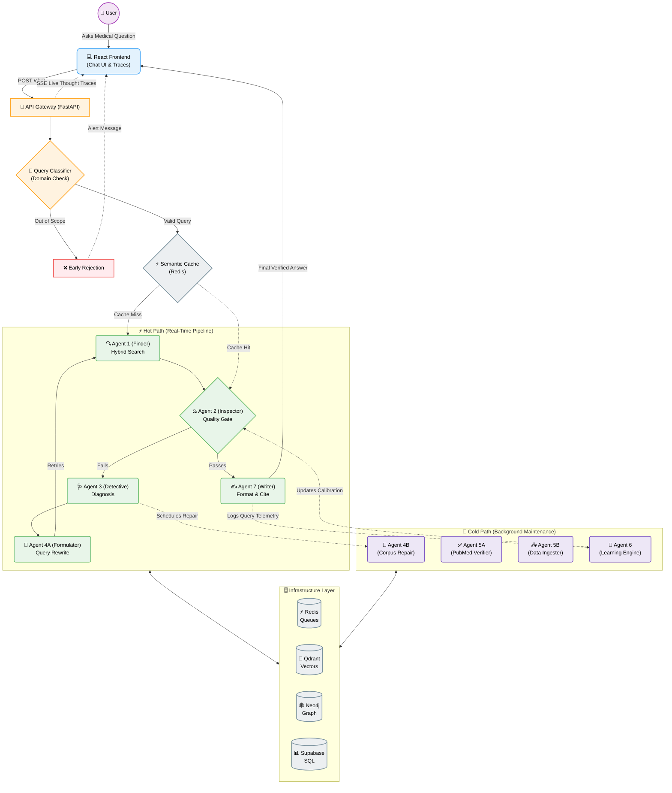
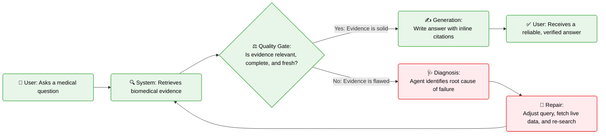
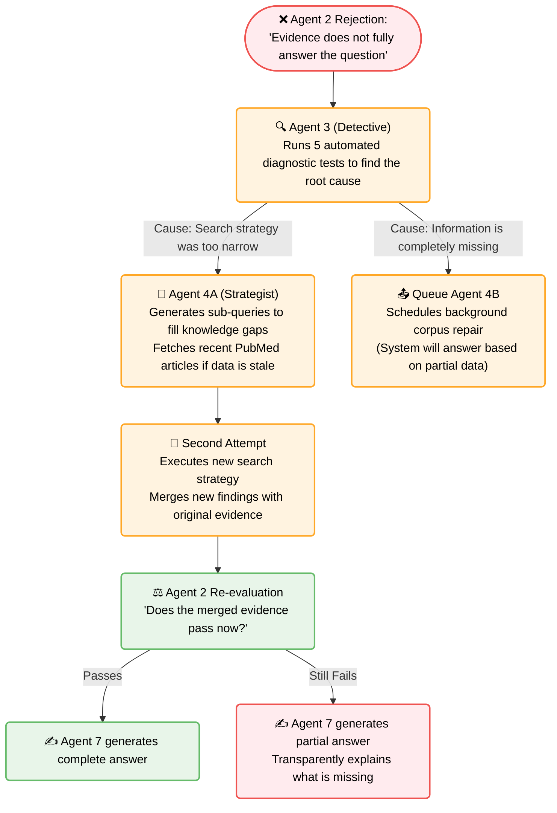

# Self-Learning and Self-Healing RAG

**A biomedical research assistant that fixes its own mistakes.**

Most AI assistants fail silently — they give you a confident wrong answer and you never know it was wrong. Self-Learning and Self-Healing RAG is different. When it cannot find good evidence, it diagnoses why, repairs itself, and tries again before giving you any answer.

Built on 1,767 PubMed papers across immunotherapy, drug interactions, and genomics.

---

## System Architecture

This is the complete bird's-eye view of how the React frontend, FastAPI backend, 9 autonomous agents, and 4 specialized databases interact.



> **Note:** For a highly technical breakdown of each individual agent, the Neo4j graph expansion, and the hybrid search mechanics, please read the [ARCHITECTURE.md](ARCHITECTURE.md) document.

---

## The Core Idea



The system never gives you an answer it has not verified first.

---

## What It Can Answer

Ask questions about:
- **Immunotherapy** — pembrolizumab, nivolumab, checkpoint inhibitors, CAR-T therapy
- **Drug interactions** — CYP450 metabolism, warfarin combinations, adverse reactions
- **Genomics** — CRISPR, biomarkers, SNPs, gene expression, BRCA mutations

If you ask something unrelated to biomedical research, it tells you so and suggests relevant questions.

---

## What Happens When Evidence Is Bad (The Repair Cycle)

This is the most important part — the self-healing repair cycle:



**The key insight:** The system tries twice, merges the best evidence from both attempts, and always tells you honestly what it could and could not find.

---

## How It Gets Smarter Over Time

Agent 6 watches every query and learns from the results:

```mermaid
flowchart LR
    classDef data fill:#e3f2fd,stroke:#42a5f5,stroke-width:2px,color:#000,rx:5px
    classDef engine fill:#f3e5f5,stroke:#ab47bc,stroke-width:2px,color:#000,rx:10px
    classDef optimization fill:#e8f5e9,stroke:#66bb6a,stroke-width:2px,color:#000,rx:5px

    subgraph INPUTS ["Data Sources (What Agent 6 observes)"]
        I1["Query Outcomes (Pass/Fail)"]:::data
        I2["User Feedback (Thumbs up/down)"]:::data
        I3["Weekly Automated Benchmark Scores"]:::data
    end

    A6(["🧠 Agent 6 (Longitudinal Learning Engine)"]):::engine

    subgraph OUTPUTS ["System Optimizations (How it improves)"]
        O1["Recalibrates confidence scores to match reality"]:::optimization
        O2["Identifies knowledge gaps for Agent 5A to fill"]:::optimization
        O3["Adjusts cache expiry (fast-changing topics expire sooner)"]:::optimization
        O4["Generates actionable recommendations for human admins"]:::optimization
    end

    INPUTS --> A6
    A6 --> OUTPUTS
```



**Result:** The 86.7% baseline pass rate improves automatically every week as the system learns from real usage.

---

## The Transparency Feature

Every step the system takes is visible in real time. You can watch each agent think:

```
Agent 1 — Finder
  OBS  Query: "How does pembrolizumab work?" — simple factual type
  THK  Immunotherapy cluster. No date restriction needed.
  ACT  Hybrid search: dense + sparse. Apply cluster filter.
  OUT  5 chunks retrieved. Top score: 0.934. All from 2021-2023.

Agent 2 — Inspector
  OBS  5 chunks. Avg relevance 0.89. All mention PD-1 pathway.
  THK  Good relevance. Completeness checks out. Freshness OK.
  ACT  All 5 checks pass. Confidence calibrated to 0.82.
  OUT  PASS -> Agent 7 can generate.

Agent 7 — Writer
  OBS  5 verified chunks. Confidence 0.82. Format: prose.
  THK  Good evidence. Generate with inline citations.
  ACT  Generate response. Extract claim provenance.
  OUT  312 chars. 3 citations. Ready.
```

This OBS/THK/ACT/OUT format (called ReAct) shows you exactly why the system made each decision.

---

## Results

| Metric | Value |
|--------|-------|
| Benchmark pass rate | **86.7%** |
| Papers indexed | **1,767** |
| Searchable chunks | **22,600+** |
| Average confidence | **0.67** |
| Cache speedup | **3.4×** |
| Monthly cost | **₹0** |

---

## Quick Start

```bash
# Clone the repository
git clone https://github.com/pavan939111/SelfLearning_Rag.git
cd SelfLearning_Rag

# Install Python dependencies
pip install -r requirements.txt

# Add your API keys (copy the example file)
cp keys.txt.example keys.txt
# Edit keys.txt with your credentials

# Test all database connections
python test_connections.py

# Build the corpus (1-2 hours, can be interrupted)
python run_ingestion.py

# Start the backend
uvicorn api.main:app --port 8000

# Start the frontend (new terminal)
cd frontend && npm install && npm run dev
```

Open **http://localhost:5173**

See [SETUP.md](SETUP.md) for detailed instructions including free cloud service setup.

---

## Tech Stack

| What | Technology |
|------|-----------|
| AI reasoning | Gemini 2.0 Flash |
| Biomedical embeddings | S-PubMedBert-MS-MARCO |
| Vector search | Qdrant Cloud |
| Database | Supabase PostgreSQL |
| Knowledge graph | Neo4j AuraDB |
| Cache + queues | Upstash Redis |
| Backend API | FastAPI + Celery |
| Frontend | Vite + React |

All on free tier. Zero monthly cost.

---

## Project Structure

```
selflearning_rag/
├── agents/          # The nine agents
│   ├── models.py    # Shared data contracts (Pydantic)
│   ├── agent1_retrieval.py
│   ├── agent2_evaluator.py
│   ├── agent3_classifier.py
│   ├── agent4a_formulator.py
│   ├── agent4b_repair.py
│   ├── agent5a_verifier.py
│   ├── agent6_learning.py
│   ├── agent7_generator.py
│   └── repair_cycle.py
├── api/             # FastAPI backend
├── database/        # Database clients
├── ingestion/       # Paper fetching and processing
├── workers/         # Background Celery jobs
├── utils/           # Logging and thought traces
├── scripts/         # Setup and verification scripts
├── tests/           # Test suite
├── frontend/        # React UI
├── SETUP.md         # Detailed setup guide
├── ARCHITECTURE.md  # Technical deep dive
└── CHANGELOG.md     # Version history
```

---

## License

MIT — Pavan Kumar Kunukuntla — 2026
