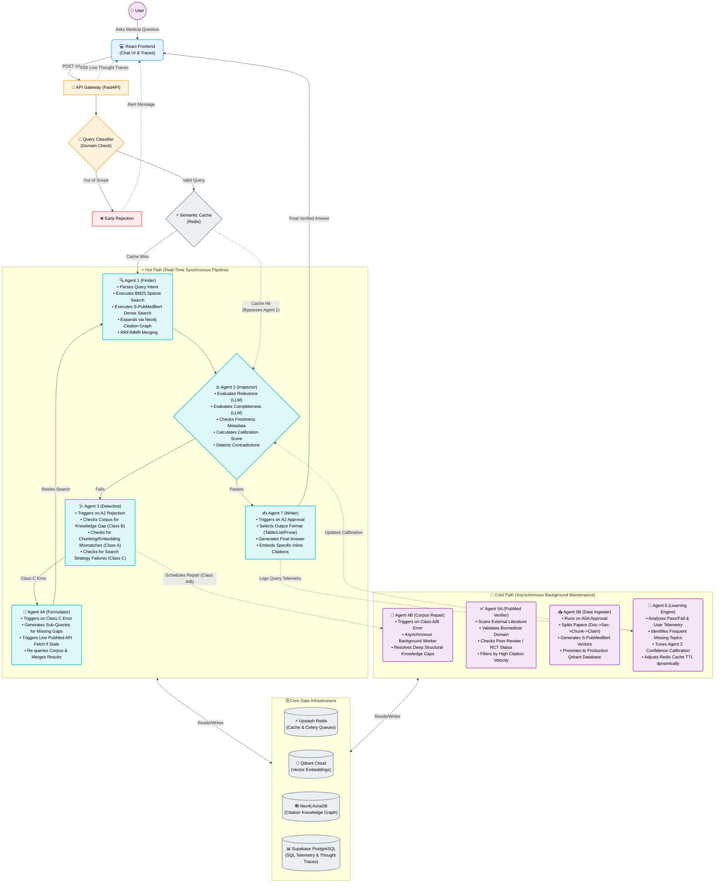

# Self-Learning and Self-Healing RAG

A biomedical research assistant that diagnoses and fixes its own mistakes before giving you an answer.

---

## Why This Exists

Standard AI assistants and Retrieval-Augmented Generation (RAG) systems suffer from a fatal flaw: they fail silently. If they retrieve the wrong information or don't find enough data, they will confidently hallucinate an answer anyway. Self-Learning and Self-Healing RAG solves this by aggressively rejecting its own evidence. When it fails to find the perfect answer, it pauses, diagnoses the root cause of the failure, reformulates its search strategy, and tries again—guaranteeing you only receive verified, highly accurate medical information.

---

## How It Works — System Overview



---

## The Nine Agents

| Agent | Role | One-line description |
|---|---|---|
| **Agent 1** | Finder | Scours databases using hybrid search and knowledge graphs to find evidence. |
| **Agent 2** | Inspector | The strict quality gate that aggressively rejects poor or incomplete evidence. |
| **Agent 3** | Detective | Diagnoses exactly why Agent 2 rejected the evidence (the root cause). |
| **Agent 4A** | Formulator | Real-time repair engine that rewrites queries and fetches live PubMed data. |
| **Agent 4B** | Mechanic | Background worker that permanently fixes structural gaps in the database. |
| **Agent 5A** | Verifier | Scans new papers and rejects junk science (non-peer-reviewed/low impact). |
| **Agent 5B** | Ingester | Breaks down approved papers into searchable chunks and vectors. |
| **Agent 6** | Brain | Long-term learning engine that optimizes the system based on user feedback. |
| **Agent 7** | Writer | Generates the final human-readable answer with explicit inline citations. |

---

## Quick Start

```bash
git clone https://github.com/pavan939111/SelfLearning_Rag.git
cd SelfLearning_Rag
pip install -r requirements.txt
cp keys.txt.example keys.txt
python run_ingestion.py
uvicorn api.main:app --port 8000
```

---

## Tech Stack

| Layer | Technology |
|---|---|
| AI Reasoning | Gemini 2.0 Flash |
| Vector Search | Qdrant Cloud |
| Knowledge Graph | Neo4j AuraDB |
| Telemetry Database | Supabase PostgreSQL |
| Cache & Queues | Upstash Redis |
| API Backend | FastAPI + Celery |
| Embeddings | S-PubMedBert-MS-MARCO |
| Frontend | React + Vite |

---

## Results

| Metric | Value |
|---|---|
| Benchmark pass rate | **86.7%** |
| Papers indexed | **1,767** |
| Searchable chunks | **22,600+** |
| Average confidence | **0.67** |
| Synthetic QA Pairs | **50** |

---

## Learn More

- [Architecture deep dive →](ARCHITECTURE.md)
- [Agent reference →](AGENTS.md)
- [Setup guide →](SETUP.md)
