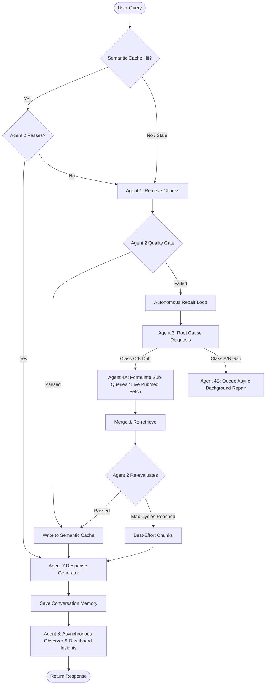

# FailureRAG Architecture & Codebase Analysis

Welcome! This document provides a highly detailed analysis of the **FailureRAG** system—a state-of-the-art, self-learning, multi-agent Retrieval-Augmented Generation (RAG) codebase designed for high-reliability medical/biomedical information retrieval.

---

## 1. Structural Overview & Component Hierarchy

FailureRAG is organized as a multi-tier, modular architecture separating ingestion, agentic orchestration, storage, external API integration, background execution, and FastAPI routes. Below is the system directory layout:

```
SelfLearning_Rag/
├── agents/                      # Agent Orchestration Layer
│   ├── agent1_retrieval.py      # Agent 1: Query Classification & Hybrid Retrieval
│   ├── agent2_evaluator.py      # Agent 2: Quality Gate (blocking/non-blocking checks)
│   ├── agent3_classifier.py     # Agent 3: Root Cause Failure Classifier
│   ├── agent4a_formulator.py    # Agent 4A: Gap Analyzer, Query Formulator, Live PubMed Fetcher
│   ├── agent4b_repair.py        # Agent 4B: Background repair scheduler
│   ├── agent5a_verifier.py      # Agent 5A: Standalone Quality-Gate Verifier for Ingestion
│   ├── agent6_learning.py       # Agent 6: Observes queries, records patterns, calibration & gaps
│   ├── agent7_generator.py      # Agent 7: Citation-grounded Conversational Response Generator
│   ├── cache_manager.py         # 32-bit SimHash semantic cache manager (Redis)
│   ├── conversation_memory.py   # Multi-turn history manager with LLM compression (Redis)
│   ├── live_fetch_ingester.py   # Helper to ingest live PubMed documents
│   └── repair_cycle.py          # A2 -> A3 -> A4A iterative repair loop orchestrator
├── ingestion/                   # Data Ingestion & Indexing Pipeline
│   ├── chunker.py               # Hierarchical Chunker (Document -> Section -> Semantic -> Proposition)
│   ├── embedder.py              # S-PubMedBert-MS-MARCO biomedical embeddings
│   ├── fetcher.py               # Bulk PubMed paper fetcher (esearch/efetch E-Utilities)
│   └── pipeline.py              # Core sequential pipeline (Verifier -> Chunk -> Embed -> Qdrant/Neo4j/Supabase)
├── database/                    # Persistence Clients
│   ├── neo4j_client.py          # Knowledge Graph (Paper / TopicCluster relationships)
│   ├── qdrant_client.py         # Vector DB (Collections per hierarchical level)
│   ├── redis_client.py          # Semantic Cache & Celery Broker connection
│   └── supabase_client.py       # SQL State DB, Ingestion Logs, Repair history & Insights
├── api/                         # REST API (FastAPI)
│   ├── main.py                  # Lifespan, middlewares (CORS, Rate Limit), and startup verification
│   ├── middleware/              # Custom middleware (Rate Limiting)
│   ├── models/                  # Pydantic request/response schemas
│   └── routes/                  # chat.py, admin.py (dashboard stats), health.py
├── workers/                     # Asynchronous Background Worker Layer (Celery)
│   ├── celery_app.py            # Celery configurations with priority queues
│   └── repair_tasks.py          # Rechunking, Reembedding, Metadata fix & Live-fetch ingestion
├── config.py                    # Pydantic Settings parsing `keys.txt`
└── requirements.txt             # Project requirements
```

---

## 2. Multi-Agent RAG Pipeline Workflow

The primary entry point is the `/api/chat` route in `api/routes/chat.py`. It follows a highly sophisticated sequential flow:



### Flow Step-by-Step

1. **Semantic Cache Lookup**: Project the query onto 32 random hyperplanes using a **32-bit SimHash** inside `CacheManager`. If a hit occurs in Redis, run `Agent 2` evaluation. If it passes freshness and completeness, return the results immediately (Cache HIT!).
2. **Agent 1 (Retrieval)**: If a cache miss or stale entry occurs, `QueryClassifier` uses `gemini-2.0-flash` to classify the query type (`simple_factual`, `multi_hop`, `comparative`, `temporal`, `exploratory`) and extract key medical entities. `MetadataPreFilter` constructs Qdrant filters. `HybridRetriever` runs dense vector search, performs **Reciprocal Rank Fusion (RRF)** with keyword matches, applies safety filtering, and re-ranks via **Maximum Marginal Relevance (MMR)** to maximize diversity.
3. **Agent 2 (Quality Gate)**: Conducts 5 validation checks:
    - **Check 1: Retrieval Relevance** (LLM check - Blocking)
    - **Check 2: Completeness Grounding** (LLM gap analysis - Blocking)
    - **Check 3: Freshness** (Metadata-based topic velocity check - Non-blocking)
    - **Check 4: Calibration** (Corpus density check - Non-blocking)
    - **Check 5: Cross-Chunk Contradiction** (LLM contradiction check - Non-blocking)
4. **Autonomous Repair Cycle (`RepairCycle`)**: If `Agent 2` fails, `Agent 3` diagnoses the root cause:
    - **Class C (Query Issue)**: Routes to **Agent 4A**, which performs gap analysis, formulates targeted clinical sub-queries, re-retrieves, and merges chunks. If `knowledge_drift` is flagged, `Agent 4A` triggers a **Live PubMed Fetch** synchronous fallback.
    - **Class A/B (Data/Knowledge Gap)**: Routes to **Agent 4B**, which schedules async Celery tasks (`rechunk`, `reembed`, `metadata_fix`, `live_ingestion`) to permanently repair the corpus.
5. **Agent 7 (Generator)**: Synthesizes a conversational response based *only* on the verified chunks with inline `(Author Year)` citations. Any coverage gaps or contradictions are transparently acknowledged.
6. **Conversation Memory**: Saved inside Redis. Verbose history is compressed via `gemini-2.0-flash` summarization once verbatim turns exceed `6` to prevent context bloat.
7. **Agent 6 (Strategic Self-Learning)**: Submits queries, failures, gaps, and calibration statistics asynchronously into Supabase tables (`agent6_patterns`, `agent6_gaps`, `agent6_calibration`). It scans these metrics to raise actionable, high-priority system insights.

---

## 3. Storage & Infrastructure Schema

FailureRAG is backed by four distinct database layers, each performing a specialized task:

### A. Vector Database: Qdrant
Uses a hierarchical layout of four collections, allowing the retriever to search at different granularities:
- `failurerag_document` (Level 1: Title + Abstract vector)
- `failurerag_section` (Level 2: Structured section vector)
- `failurerag_semantic` (Level 3A: Sentence groups vector, ~150-250 characters)
- `failurerag_proposition` (Level 3B: Extracted single factual propositions vector)

Payload indexing is configured for high-speed keyword filtering (`topic_cluster`, `year`, `evidence_level`, `freshness_score`, `contradiction_flag`, `paper_id`, `level`, `section_type`).

### B. Graph Database: Neo4j
Maps the structural relationships in literature:
- Nodes: `Paper` nodes (storing metadata) and `TopicCluster` nodes (`immunotherapy`, `drug_interactions`, `genomics`).
- Relationships: `(Paper)-[:BELONGS_TO]->(TopicCluster)`.

### C. Priority Queue & Cache: Redis
- **Semantic Caching**: SimHash hex-keys with topic-specific TTL dynamic calculation based on cluster velocity (e.g., fast decay for high-velocity medical fields like Immunotherapy).
- **Session Memory**: JSON-serialized active conversation threads.
- **Celery Broker**: Houses queue channels (`high_priority`, `medium_priority`, `low_priority`) for workers.

### D. Relational DB: Supabase (PostgreSQL)
Houses state, log histories, and metacognitive dashboards:
- `ingestion_logs`: Log of successfully/failed paper ingestions.
- `agent_failures`: Tracking of Quality Gate rejections, root causes, and repair outcomes.
- `agent6_patterns`: Aggregated system retrieval failure patterns.
- `agent6_gaps`: Documented topic coverage gaps.
- `agent6_calibration`: Stored actual pass rate vs. expressed confidence mapping.
- `agent6_insights`: Actionable, strategic self-learning recommendations.
- `repair_queue` / `repair_history`: Tracking tables for Agent 4B Celery repairs.

---

## 4. Key Strengths of the Implementation

1. **Ultra-Robust and Defensive Coding**: Code includes extensive exception handling and default fallbacks. A crash in Neo4j, Redis, or a Gemini rate limit will *never* crash the customer-facing endpoint; instead, the system gracefully falls back to best-effort retrieval, single-thread processing, or direct pass evaluation.
2. **Highly Grounded Citations**: The model is restricted to synthesize responses *only* using provided source chunks and must supply strict inline citations. Disagreements and literature gaps are addressed transparently.
3. **Pipelined verification**: `Agent 5A` ensures papers meet strict domain, evidence level, and contradiction filters *before* they are chunked and inserted during ingestion.
4. **Iterative Autonomous Recovery**: The A2 -> A3 -> A4A loop represents a true cognitive repair pipeline, actively correcting queries and seeking missing information from the external PubMed API live when necessary.
